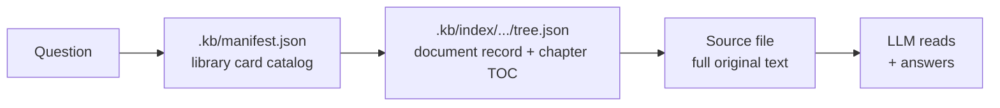
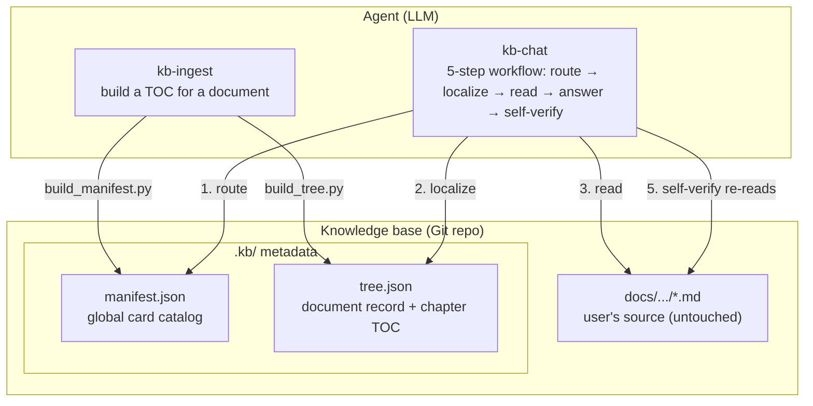
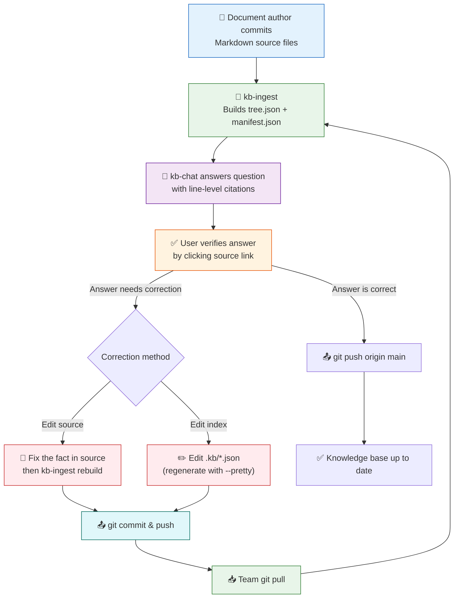

# kb-pilot

> TOC + source = knowledge base. Let the LLM read like a human, instead of shredding books into a vector database.

**Core insight**: For well-structured Markdown knowledge bases, an LLM can often answer accurately with **a precise TOC and the relevant source text**, without adding vector embeddings, chunk splitting, or entity-relationship graphs. See [AGENTS.md](./AGENTS.md) for the design principles — what the system forbids and why. They are stated there and only there; this README does not paraphrase them.

**Forward-looking**: This design benefits from stronger LLMs — routing, reasoning, and self-verification can improve without rebuilding a retrieval stack.

**Zero intrusion**: Original documents stay where they are. All metadata (the index) lives under `.kb/` in a mirrored layout. Delete `.kb/` to fully uninstall — user files are untouched.

## Why kb-pilot?

| | Traditional RAG | kb-pilot |
|---|---|---|
| Document processing | Shred into chunks → vectorize | Keep full source, zero modification |
| Retrieval | Semantic similarity over chunks | TOC-guided source navigation |
| Infrastructure | Embedding model + vector DB + often GPU-backed services | Filesystem + Git |
| Answer tracing | "somewhere near a chunk" | `docs/api/auth.md#L16` line-level precision |
| Corrections | Requires a separate system | Edit the source, re-ingest — the source is the correction |
| Deployment cost | High infrastructure cost | Low infrastructure cost |
| User directory intrusion | Must migrate to a required layout | **Zero intrusion**, metadata in `.kb/` |
| Robustness to messy sources / scale | Handles large, unstructured, heterogeneous corpora and fragmented docs | Depends on clear heading structure and a bounded corpus |

## Scope

kb-pilot is not a universal replacement for every RAG system. It is a focused choice for **bounded, well-structured Markdown knowledge bases** — tens to hundreds of documents within one team, product, or domain — where traceability matters more than millisecond retrieval speed.

It works best for internal policies, product manuals, technical docs, compliance notes, financial procedures, and other sources where:

- Documents have clear heading hierarchy (`#`, `##`, `###`) and stable source files
- The knowledge base is maintained like a Git repo, with humans responsible for document quality
- Answers must cite exact source lines
- The agent can spend time reading the relevant section and self-verifying claims against the source
- The repository maps to one team, product, policy area, or technical domain

It is not designed for massive unstructured corpora, real-time web-scale search, millisecond-latency retrieval, or replacing document cleanup and human review.

In short: kb-pilot trades broad retrieval infrastructure for a transparent, line-level, auditable workflow.

**When RAG is the better fit**: choose a conventional RAG system when you need retrieval over large or unstructured corpora that lack heading structure, web-scale or real-time search, millisecond query latency, or resilience to documents that are messy and not worth reading precisely. The two are complementary: use kb-pilot where the source is clean and answers must be auditable; use RAG where the corpus is large, messy, and recall-by-similarity matters more than exact provenance.


## Quick start

**Prerequisites**: Python 3.10+, Git. The **core** scripts (`kb-ingest`, `kb-chat`) use only the Python standard library — no extra dependencies. The optional `kb-polish` skill converts source documents with AnyDoc and needs a few third-party packages; see its `compatibility` field.

### 1. Ingest a document

```
Use Skill: kb-ingest to ingest docs/api/auth.md into the knowledge base
```

### 2. Ask a question

```
Use Skill: kb-chat What's the difference between Docker containers and VMs?
```

### 3. Correct an answer by editing the source

```
User: That's wrong — the JWT expiry is 24h, not 12h.
```

Directly edit the source file (fix the fact in `docs/api/auth.md`), then re-ingest it via `kb-ingest` so `tree.json` line numbers and checksum stay in sync with the corrected text. The source is the single source of truth — there is no separate correction layer. See Step 4 below for the full maintain workflow.

### 4. Initialize from an existing Git repo

```
Use Skill: kb-ingest to initialize the knowledge base from https://github.com/org/docs.git
```


## Architecture

### How it works



### System components



### Knowledge base layout

```
{kb_path}/                          # Git repo root
├── .kb/                            # kb-pilot metadata (centralized)
│   ├── manifest.json               # global routing table (script-generated, minified)
│   └── index/                      # mirrored directory
│       └── docs/
│           └── api/
│               └── auth/           # corresponds to docs/api/auth.md
│                   └── tree.json   # document record + heading skeleton (minified)
├── docs/                           # user's original documents (any structure, untouched)
│   └── api/
│       └── auth.md
└── README.md
```

Path mapping: source file `docs/api/auth.md` → metadata directory `.kb/index/docs/api/auth/`.

### What the two metadata files hold

- **`tree.json`** (one per document) — the document record plus the heading skeleton
- **`manifest.json`** (one per knowledge base) — a JSON **array** of routing entries, one per document

Both are minified by default (fewer tokens when the LLM reads them); regenerate with `--pretty` for a readable copy. Field shapes are defined where they are consumed — the `kb-ingest` and `kb-chat` SKILLs document what they write and read; this README keeps only the summary above.

**Core vs. optional**: `kb-ingest` and `kb-chat` are the core and use only the Python standard library. `kb-polish` is optional, pulls in third-party conversion dependencies, and never has to run for the knowledge base to work.

### Where each document is authoritative

| Document | It owns | It does not |
|---|---|---|
| [AGENTS.md](./AGENTS.md) | the design principles: what the system does, what it forbids, and why | anything a first-time reader needs before deciding to adopt |
| [FAQ.md](./FAQ.md) | boundaries, trade-offs, comparisons, how to correct things | restating scope numbers or principles owned elsewhere |
| README.md (this file) | what you get and how to start: scope, quick start, end-to-end workflow | a second copy of the principles, the schema, or the constraint list |

There is no precedence rule because there is no overlap to adjudicate. If you find these
documents disagreeing, that is a defect in the README or the FAQ — not a tie to be broken.


## Best practice: End-to-end workflow

### Step 1: Prepare your knowledge base repository

```bash
# Create a Git repo for your knowledge base
git init kb-ops && cd kb-ops

# Add Markdown source files (author maintains structure)
git add docs/ && git commit -m "docs: initial knowledge base"
```

**Rule**: Source files must be Markdown with clear heading hierarchy (`#`, `##`, `###`). The author is responsible for structure accuracy. See AGENTS.md: *"No format conversion — PDF/Word/HTML → Markdown is the user's job, not the system's."* If your sources start as PDF/Word/Excel/PPT, you may optionally run the **kb-polish** skill to convert them to Markdown first — a user-side convenience, never a required stage.

### Step 2: Build the index

```
Use Skill: kb-ingest to ingest docs/api/auth.md
```

or initialize from an existing Git repo:

```
Use Skill: kb-ingest to initialize from https://github.com/org/docs.git
```

Scripts generate `tree.json` (heading hierarchy + line numbers) and `manifest.json` (global routing table). LLM automatically injects summaries and keywords into each tree node.

All metadata is **JSON** — script-generated (minified by default to keep LLM token use low), Git-tracked, and easy to inspect or edit by regenerating with `--pretty`.

### Step 3: Ask questions

```
Use Skill: kb-chat How does the authentication flow work?
```

**Answer format includes inline, clickable citations**:

> The authentication flow is: user submits credentials → server validates → returns JWT token.[docs/api/auth.md#L42-L58](docs/api/auth.md#L42-L58)

In VSCode, click the link — it jumps directly to the exact lines in the source file. The `#L{start}-L{end}` suffix is the standard GitHub line-range anchor.

**Self-verify**: The LLM re-checks every claim before delivery. Simple facts may need one pass; complex reasoning may require multiple re-reads.

### Step 4: Maintain knowledge

**Correct an answer by editing the source**

```
User: That's wrong — the JWT expiry is 24h, not 12h.
```

Locate the wrong lines in the source Markdown, fix the fact there, then re-ingest the document so `tree.json` line numbers and the checksum stay in sync with the corrected text. The source is the single source of truth.

**Optionally edit the index**

Script paths follow the same convention as the SKILLs: `scripts/...` is relative to the skill directory. Run the commands below from `.agents/skills/kb-ingest/`, and use `{abs_kb}` (the knowledge base absolute path) for file paths.

```bash
# Wrong summary? Adjust the document record? (run from .agents/skills/kb-ingest/)
python scripts/build_tree.py {abs_kb}/docs/api/auth.md \
  {abs_kb}/.kb/index/docs/api/auth/tree.json \
  --title "API Auth" --domain api --source-path docs/api/auth.md --pretty
# edit .kb/index/docs/api/auth/tree.json, then rebuild the (minified) manifest
python scripts/build_manifest.py {abs_kb}
git commit -m "fix: update auth module summary"
```

The index is JSON regenerated by scripts; use `--pretty` when you need a readable, editable copy. Git tracks every change.

Pass `--title` / `--domain` on every re-ingest. Both are re-derived each time rather than inherited: they are the LLM's judgement per ingest, not facts the script can re-read from the source. `domain` especially — it exists only in the index and is what kb-chat Step 1 uses as a routing hint. Omitting one drops the previous value, which the script announces on stderr and reports as `previous_title` / `previous_domain`; the flag is how you set it deliberately.

**Version awareness (drift protection)**: Each `tree.json` contains a top-level `source_sha256` checksum for the source file. When the source file updates and is re-ingested, line anchors are recomputed against the current text, so citations always point at the corrected source.

It is a checksum, not a line count: an edit that changes a number or rewords a sentence keeps the line count identical while making every citation into that section silently wrong. What it does **not** do is decide whether an existing summary is still accurate — the script reports what it carried over (`reused_fillings`, `source_changed`), and judging staleness is the LLM's job.

### Step 5: Team collaboration

```bash
# Knowledge contributor pushes updates
git push origin main

# Knowledge consumer pulls latest
git pull origin main
Use Skill: kb-chat Has the auth flow changed?
```

Knowledge update = `git pull`, not "re-index everything".

### End-to-end workflow



### Core value of this workflow

- **Citation traceability**: Every answer maps to a specific source file and line range
- **Knowledge as code**: Metadata is JSON — regenerated by scripts, versioned, auditable
- **Correction as source edit**: Error found → fix the source → re-ingest → commit → push
- **Collaboration as pull**: Team updates via `git pull`, no "re-index" delays
- **Can benefit from better models**: LLM improvements may improve routing, reasoning, and self-verification without rebuilding the index format.

### Scaling

One knowledge base = one Git repo = one cognitive boundary. When a single repo exceeds a few hundred documents, split by team or domain.

- Engineering team knowledge base → one Git repo
- Finance team knowledge base → another Git repo


## FAQ

See [FAQ.md](./FAQ.md) for common questions and design trade-offs.


## License

MIT
