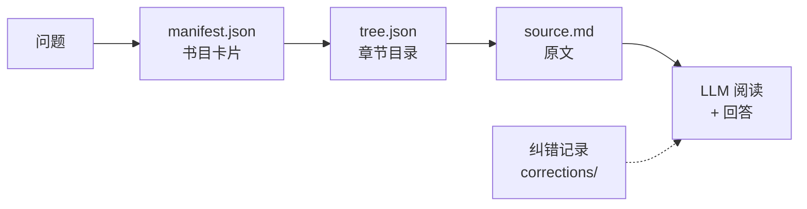
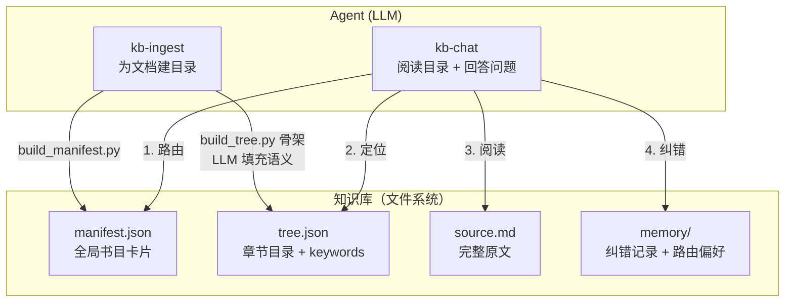

# kb-pilot

> 目录 + 原文 = 知识库。让 LLM 像人一样阅读，而不是把书切碎喂给向量数据库。



**核心洞察**：LLM 需要的是**精准的目录和完整的原文**，而不是向量嵌入、Chunk 切分、实体关系图。

---

## 为什么选 kb-pilot？

| | 传统 RAG | kb-pilot |
|---|---|---|
| 文档处理 | 切碎成 Chunk → 向量化 | 保留完整原文 |
| 检索方式 | 语义相似度（概率性） | 目录索引（确定性） |
| 基础设施 | Embedding 模型 + 向量数据库 + GPU | 文件系统 + Git |
| 答案溯源 | "某个 Chunk 附近" | `source.md#L16` 行级精确 |
| 纠错 | 需额外系统 | 对话即纠错，jsonl 持久化 |
| 部署成本 | 高（GPU、向量库） | **零** |
| 214 篇文档 41 用例 | 70-90%（依赖 embedding 质量） | **41/41** + 路由盲测 10/10 |

---

## 快速开始

```bash
pip install pyyaml
```

### 接入文档

```
Use Skill: kb-ingest 将 {文档路径} 接入知识库
```

### 提问

```
Use Skill: kb-chat Docker 容器和虚拟机有什么区别？
```

### 纠错

```
User: 不对，Docker 20.10 启动时间应该是 1.5s，不是 1.2s
```

系统自动记录纠错，后续相同问题优先使用纠正后的答案。多人纠错冲突时展示所有版本。多人对同一事实给出相同答案时，重复记录视为共识信号，强化可信度。并发写入冲突由 Git 合并机制解决，不在应用层加锁。

### 大规模怎么办

当一个知识库超过几百篇文档时，**不要在单库内做 manifest 分片或路由分层**——这违背"少即是多"的设计哲学。正确做法是**按认知边界拆分仓库**：

- 技术团队知识库 → 一个 git 仓库（100-300 篇）
- 财务团队知识库 → 另一个 git 仓库
- 跨团队查询 → kb-chat 在领域路由阶段选择目标仓库

一个知识库 = 一个 git 仓库 = 一个认知边界。没有人会把所有领域的书塞进一个图书馆。

---

## 架构一览



---

## 项目结构

```
kb-pilot/
├── .trae/skills/           # Agent SKILL 定义
│   ├── kb-ingest/          # 文档入库
│   │   ├── SKILL.md
│   │   └── scripts/
│   │       ├── build_tree.py
│   │       └── build_manifest.py
│   └── kb-chat/            # 知识问答
│       └── SKILL.md
├── docs/                   # 项目文档
│   ├── architecture.md     # 架构设计
│   ├── workflow.md         # 执行流程
│   ├── e2e-test-report.md  # E2E 测试报告
│   └── rag-comparison.md   # 与主流 RAG 方案对比
└── knowledge_repo/         # 知识库数据（不入库）
```

## 文档导航

| 文档 | 内容 |
|------|------|
| [architecture.md](docs/architecture.md) | 设计哲学、边界、取舍、核心组件 |
| [workflow.md](docs/workflow.md) | 入库流程、问答流程、纠错流程 |
| [e2e-test-report.md](docs/e2e-test-report.md) | 214 篇文档 41 用例测试报告（含盲测方案） |
| [rag-comparison.md](docs/rag-comparison.md) | vs SAG / LightRAG / GraphRAG / Dify / FastGPT / LlamaIndex |

## License

MIT