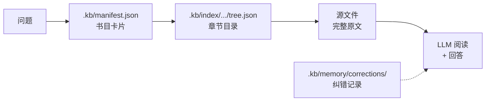
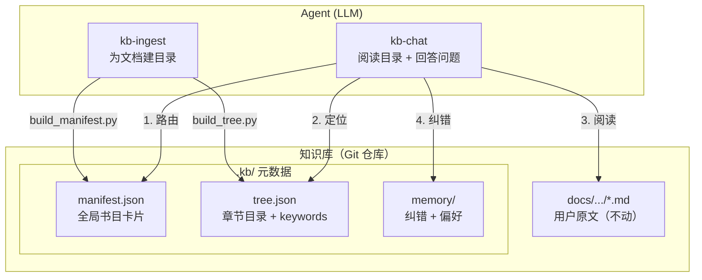

# kb-pilot

> 目录 + 原文 = 知识库。让 LLM 像人一样阅读，而不是把书切碎喂给向量数据库。



**核心洞察**：LLM 需要的是**精准的目录和完整的原文**，而不是向量嵌入、Chunk 切分、实体关系图。

**零侵入**：原始文档留在用户目录原位不动，所有元数据（索引、纠错）集中在 `.kb/` 下，镜像用户目录结构。删除 `.kb/` 即可完全移除，用户文件毫发无损。

---

## 为什么选 kb-pilot？

| | 传统 RAG | kb-pilot |
|---|---|---|
| 文档处理 | 切碎成 Chunk → 向量化 | 保留完整原文，零修改 |
| 检索方式 | 语义相似度（概率性） | 目录索引（确定性） |
| 基础设施 | Embedding 模型 + 向量数据库 + GPU | 文件系统 + Git |
| 答案溯源 | "某个 Chunk 附近" | `docs/api/auth.md#L16` 行级精确 |
| 纠错 | 需额外系统 | 对话即纠错，jsonl 持久化 |
| 部署成本 | 高（GPU、向量库） | **零** |
| 用户目录侵入 | 需迁移到指定结构 | **零侵入**，元数据存 `.kb/` |

---

## 快速开始

**前置条件**：Python 3.10+、Git、PyYAML

```bash
pip install pyyaml
```

### 接入文档

将任意位置的 Markdown 文件接入知识库（文件留在原位）：

```
Use Skill: kb-ingest 将 docs/api/auth.md 接入知识库
```

### 提问

```
Use Skill: kb-chat Docker 容器和虚拟机有什么区别？
```

### 纠错

```
User: 不对，Docker 20.10 启动时间应该是 1.5s，不是 1.2s
```

系统自动记录纠错，后续相同问题优先使用纠正后的答案。多人对同一事实给出相同答案时，重复记录视为共识信号，强化可信度。并发写入冲突由 Git 合并机制解决。

### 从现有 Git 仓库初始化

```
Use Skill: kb-ingest 从 https://github.com/org/docs.git 初始化知识库
```

### 大规模怎么办

一个知识库 = 一个 Git 仓库 = 一个认知边界。单库超过几百篇文档时，按团队/领域拆分仓库，不做分片。

- 技术团队知识库 → 一个 Git 仓库
- 财务团队知识库 → 另一个 Git 仓库

---

## 知识库目录结构

```
{kb_path}/                          # Git 仓库根目录
├── .kb/                            # kb-pilot 元数据（集中存放）
│   ├── manifest.json               # 全局路由表（脚本生成）
│   ├── memory/
│   │   ├── corrections/            # 纠错记录
│   │   └── route_preferences.json
│   └── index/                      # 镜像目录
│       └── docs/
│           └── api/
│               └── auth/           # 对应 docs/api/auth.md
│                   ├── metadata.yaml
│                   └── tree.json
├── docs/                           # 用户原始文档（任意结构，不动）
│   └── api/
│       └── auth.md
└── README.md
```

路径映射：源文件 `docs/api/auth.md` → 元数据 `.kb/index/docs/api/auth/`。

---

## 架构一览



---

## 项目结构

```
kb-pilot/
├── .trae/skills/           # Agent SKILL 定义
│   ├── kb-ingest/          # 文档入库
│   │   ├── SKILL.md
│   │   └── scripts/
│   │       ├── build_tree.py
│   │       └── build_manifest.py
│   └── kb-chat/            # 知识问答
│       └── SKILL.md
├── docs/                   # 项目文档
│   ├── architecture.md     # 架构设计
│   ├── workflow.md         # 执行流程
│   └── rag-comparison.md   # 与主流 RAG 方案对比
└── knowledge_repo/         # 知识库数据（示例，不入库）
```

## 文档导航

| 文档 | 内容 |
|------|------|
| [architecture.md](docs/architecture.md) | 设计哲学、边界、取舍、核心组件 |
| [workflow.md](docs/workflow.md) | 入库流程、问答流程、纠错流程 |
| [rag-comparison.md](docs/rag-comparison.md) | vs SAG / LightRAG / GraphRAG / Dify / FastGPT / LlamaIndex |

## License

MIT
