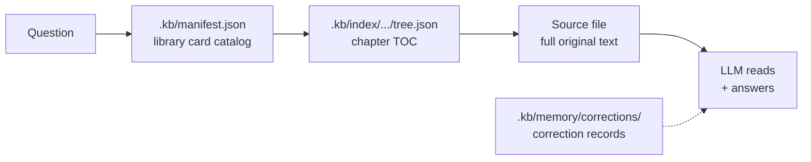
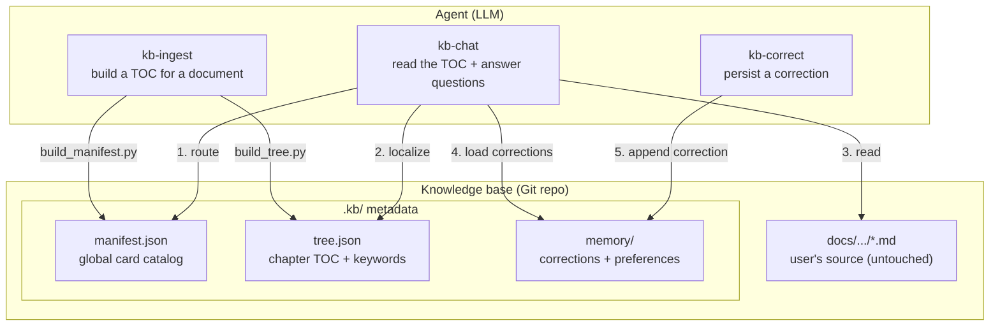

# kb-pilot

> TOC + source = knowledge base. Let the LLM read like a human, instead of shredding books into a vector database.



**Core insight**: The LLM is sufficiently intelligent — it only needs **a precise TOC and the full source text**, not vector embeddings, chunk splitting, or entity-relationship graphs. Scripts constrain the skeleton; the LLM fills the content. See [AGENTS.md](./AGENTS.md) for design principles.

**Zero intrusion**: Original documents stay where they are. All metadata (index, corrections) lives under `.kb/` in a mirrored layout. Delete `.kb/` to fully uninstall — user files are untouched.

---

## Why kb-pilot?

| | Traditional RAG | kb-pilot |
|---|---|---|
| Document processing | Shred into chunks → vectorize | Keep full source, zero modification |
| Retrieval | Semantic similarity (probabilistic) | TOC index (deterministic) |
| Infrastructure | Embedding model + vector DB + GPU | Filesystem + Git |
| Answer tracing | "somewhere near a chunk" | `docs/api/auth.md#L16` line-level precision |
| Corrections | Requires a separate system | Conversation-as-correction, jsonl-persisted |
| Deployment cost | High (GPU, vector DB) | **Zero** |
| User directory intrusion | Must migrate to a required layout | **Zero intrusion**, metadata in `.kb/` |

---

## Quick start

**Prerequisites**: Python 3.10+, Git, PyYAML

```bash
pip install pyyaml
```

### Ingest a document

Add a Markdown file from anywhere into the knowledge base (the file stays in place):

```
Use Skill: kb-ingest to ingest docs/api/auth.md into the knowledge base
```

### Ask a question

```
Use Skill: kb-chat What's the difference between Docker containers and VMs?
```

### Correct an answer

```
User: That's wrong — Docker 20.10 startup time should be 1.5s, not 1.2s
```

Use Skill: kb-correct to persist the correction. Subsequent identical questions load the correction; when multiple users give the same answer to the same fact, duplicate records are treated as a consensus signal, reinforcing confidence. Concurrent write conflicts are resolved by Git merge.

### Initialize from an existing Git repo

```
Use Skill: kb-ingest to initialize the knowledge base from https://github.com/org/docs.git
```

### Scaling

One knowledge base = one Git repo = one cognitive boundary. When a single repo exceeds a few hundred documents, split by team or domain. No sharding.

- Engineering team knowledge base → one Git repo
- Finance team knowledge base → another Git repo

---

## Knowledge base layout

```
{kb_path}/                          # Git repo root
├── .kb/                            # kb-pilot metadata (centralized)
│   ├── manifest.json               # global routing table (script-generated)
│   ├── memory/
│   │   ├── corrections/            # correction records
│   │   └── route_preferences.json
│   └── index/                      # mirrored directory
│       └── docs/
│           └── api/
│               └── auth/           # corresponds to docs/api/auth.md
│                   ├── metadata.yaml
│                   └── tree.json
├── docs/                           # user's original documents (any structure, untouched)
│   └── api/
│       └── auth.md
└── README.md
```

Path mapping: source file `docs/api/auth.md` → metadata directory `.kb/index/docs/api/auth/`.

---

## Architecture overview



---

## Project structure

```
kb-pilot/
├── AGENTS.md           # design principles — scripts constrain skeleton, LLM fills content
│   └── skills/             # Agent SKILL definitions
│       ├── kb-ingest/      # document ingestion
│       │   ├── SKILL.md
│       │   └── scripts/    # deterministic scripts (--help for usage; stdout JSON; stderr progress)
│       │       ├── build_tree.py
│       │       └── build_manifest.py
│       ├── kb-chat/        # knowledge Q&A
│       │   └── SKILL.md
│       └── kb-correct/     # correction persistence
│           └── SKILL.md
└── knowledge_repo/         # knowledge base data (example, not committed)
```

## Design philosophy

| Principle | Meaning |
|------|------|
| **TOC + source = knowledge base** | The LLM is smart enough; it only needs a precise TOC and the full source — no vectors, chunks, or graphs |
| **Trust the LLM** | Scripts only constrain the skeleton (headings, line numbers); summary, keywords, routing, and answers are all LLM-autonomous — no templates, no extraction algorithms |
| **LLM is the routing engine** | Locates documents via semantic understanding of title/summary/keywords, not keyword matching |
| **Zero intrusion** | User's source stays in place; metadata centralized under `.kb/`; delete to uninstall |
| **Deterministic skeleton + semantic flesh** | Skeleton (heading hierarchy, line numbers) is script-generated; flesh (summary, keywords) is LLM-injected |
| **Git is the source of truth** | All metadata is text files; versioning, collaboration, sync, and conflicts all go through Git |
| **Line-level tracing** | Answers cite `docs/api/auth.md#L16` — traceable and verifiable |
| **Conversation-as-correction** | User corrections persist as jsonl; duplicates = consensus; conflicts shown side by side |
| **Less is more** | No vectors, no chunks, no graphs, no sharding, no format conversion |

## License

MIT
