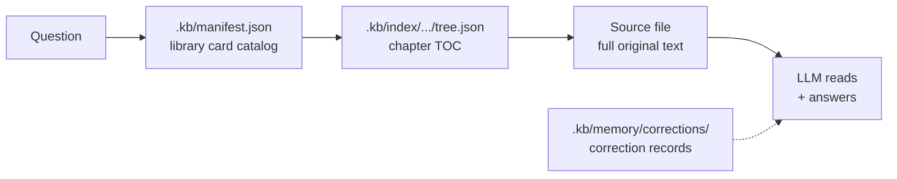
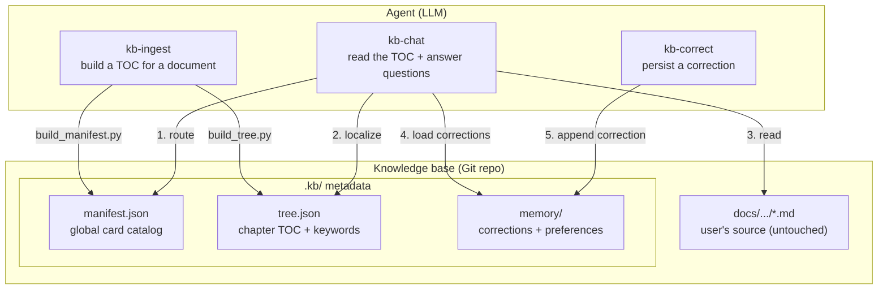

# kb-pilot

> TOC + source = knowledge base. Let the LLM read like a human, instead of shredding books into a vector database.

**Core insight**: For well-structured Markdown knowledge bases, an LLM can often answer accurately with **a precise TOC and the relevant source text**, without adding vector embeddings, chunk splitting, or entity-relationship graphs. Scripts constrain the skeleton; the LLM fills the content. See [AGENTS.md](./AGENTS.md) for design principles.

**Forward-looking**: This design benefits from stronger LLMs — routing, reasoning, and self-verification can improve without rebuilding a retrieval stack.

**Zero intrusion**: Original documents stay where they are. All metadata (index, corrections) lives under `.kb/` in a mirrored layout. Delete `.kb/` to fully uninstall — user files are untouched.

## Why kb-pilot?

| | Traditional RAG | kb-pilot |
|---|---|---|
| Document processing | Shred into chunks → vectorize | Keep full source, zero modification |
| Retrieval | Semantic similarity over chunks | TOC-guided source navigation |
| Infrastructure | Embedding model + vector DB + often GPU-backed services | Filesystem + Git |
| Answer tracing | "somewhere near a chunk" | `docs/api/auth.md#L16` line-level precision |
| Corrections | Requires a separate system | Conversation-as-correction, jsonl-persisted |
| Deployment cost | High infrastructure cost | Low infrastructure cost |
| User directory intrusion | Must migrate to a required layout | **Zero intrusion**, metadata in `.kb/` |

## Scope

kb-pilot is not a universal replacement for every RAG system. It is a focused choice for **small to mid-sized, well-structured Markdown knowledge bases** where traceability matters more than millisecond retrieval speed.

It works best for internal policies, product manuals, technical docs, compliance notes, financial procedures, and other sources where:

- Documents have clear heading hierarchy (`#`, `##`, `###`) and stable source files
- The knowledge base is maintained like a Git repo, with humans responsible for document quality
- Answers must cite exact source lines
- The agent can spend time reading the relevant section and self-verifying claims against the source

It is not designed for massive unstructured corpora, real-time web-scale search, millisecond-latency retrieval, or replacing document cleanup and human review.

In short: kb-pilot trades broad retrieval infrastructure for a transparent, line-level, auditable workflow. It is strongest when the source documents are clean, structured, and worth reading precisely.

## Evaluation

A small structured test suite is available under `docs/test-suites/`:

- [Hard RAG questions](docs/test-suites/zx-bank-kb-hard-rag-questions.md)
- [kb-chat execution report](docs/test-suites/kb-chat-strict-execution-report.md)

This is a hand-auditable execution record on a small, structured Markdown knowledge base. It is not an automated benchmark or a claim of general performance across open-domain RAG workloads.


## Quick start

**Prerequisites**: Python 3.10+, Git, PyYAML

```bash
pip install pyyaml
```

### 1. Ingest a document

```
Use Skill: kb-ingest to ingest docs/api/auth.md into the knowledge base
```

### 2. Ask a question

```
Use Skill: kb-chat What's the difference between Docker containers and VMs?
```

### 3. Correct an answer

```
User: That's wrong — the JWT expiry is 24h, not 12h.
Use Skill: kb-correct to persist this correction.
```

`kb-correct` appends the correction (append-only) to `.kb/memory/corrections/`. Subsequent identical questions load the correction; when multiple users give the same answer to the same fact, duplicate records are treated as a consensus signal, reinforcing confidence. Conflicting corrections are shown side by side. Concurrent write conflicts are resolved by Git merge.

**Version awareness**: Each `tree.json` node includes a `sha256` checksum of the source file. When a source file is updated and re-ingested, the new tree replaces the old one. Corrections are loaded alongside the current `tree.json` — the LLM reads both and can disregard corrections that no longer apply to the current version. This is handled at read time, not index time.

### 4. Initialize from an existing Git repo

```
Use Skill: kb-ingest to initialize the knowledge base from https://github.com/org/docs.git
```


## Architecture

### How it works



### System components



### Knowledge base layout

```
{kb_path}/                          # Git repo root
├── .kb/                            # kb-pilot metadata (centralized)
│   ├── manifest.json               # global routing table (script-generated)
│   ├── memory/
│   │   ├── corrections/            # correction records
│   │   └── route_preferences.json
│   └── index/                      # mirrored directory
│       └── docs/
│           └── api/
│               └── auth/           # corresponds to docs/api/auth.md
│                   ├── metadata.yaml
│                   └── tree.json
├── docs/                           # user's original documents (any structure, untouched)
│   └── api/
│       └── auth.md
└── README.md
```

Path mapping: source file `docs/api/auth.md` → metadata directory `.kb/index/docs/api/auth/`.

### Project structure

```
kb-pilot/
├── AGENTS.md           # design principles — scripts constrain skeleton, LLM fills content
├── skills/             # Agent SKILL definitions
│   ├── kb-ingest/      # document ingestion
│   │   ├── SKILL.md
│   │   └── scripts/    # deterministic scripts
│   │       ├── build_tree.py
│   │       └── build_manifest.py
│   ├── kb-chat/        # knowledge Q&A
│   │   └── SKILL.md
│   └── kb-correct/     # correction persistence
│       └── SKILL.md
└── knowledge_repo/     # knowledge base data (example, not committed)
```


## Design philosophy

| Principle | Meaning |
|------|------|
| **TOC + source = knowledge base** | For structured Markdown, a precise TOC plus source text can often be enough — no vectors, chunks, or graphs by default |
| **Trust the LLM** | Scripts only constrain the skeleton (headings, line numbers); summary, keywords, routing, and answers are all LLM-autonomous — no templates, no extraction algorithms |
| **LLM is the routing engine** | Locates documents via semantic understanding of title/summary/keywords, not keyword matching |
| **Zero intrusion** | User's source stays in place; metadata centralized under `.kb/`; delete to uninstall |
| **Deterministic skeleton + semantic flesh** | Skeleton (heading hierarchy, line numbers) is script-generated; flesh (summary, keywords) is LLM-injected |
| **Git as the collaboration layer** | All metadata is text files; versioning, collaboration, sync, and conflicts can go through Git |
| **Line-level tracing** | Answers cite `docs/api/auth.md#L16` — traceable and verifiable |
| **Conversation-as-correction** | User corrections persist as jsonl; duplicates = consensus; conflicts shown side by side |
| **Less is more** | No vectors, no chunks, no graphs, no sharding, no format conversion |
| **Skill-based** | Atomic capabilities (`kb-ingest`, `kb-chat`, `kb-correct`) are composable — integrate into larger Agents, combine for cross-repo queries, or extend with new Skills |


## Best practice: End-to-end workflow

### Step 1: Prepare your knowledge base repository

```bash
# Create a Git repo for your knowledge base
git init kb-ops && cd kb-ops

# Add Markdown source files (author maintains structure)
git add docs/ && git commit -m "docs: initial knowledge base"
```

**Rule**: Source files must be Markdown with clear heading hierarchy (`#`, `##`, `###`). The author is responsible for structure accuracy. See AGENTS.md: *"No format conversion — PDF/Word/HTML → Markdown is the user's job, not the system's."*

### Step 2: Build the index

```
Use Skill: kb-ingest to ingest docs/api/auth.md
```

or initialize from an existing Git repo:

```
Use Skill: kb-ingest to initialize from https://github.com/org/docs.git
```

Scripts generate `tree.json` (heading hierarchy + line numbers) and `manifest.json` (global routing table). LLM automatically injects summaries and keywords into each tree node.

All metadata is **plain text JSON** — human-readable, editable, Git-tracked.

### Step 3: Ask questions

```
Use Skill: kb-chat How does the authentication flow work?
```

**Answer format includes line-level citations**:

> The authentication flow is: user submits credentials → server validates → returns JWT token.
> 📎 Reference: `docs/api/auth.md#L42-L58`

In VSCode, click the link — it jumps directly to the exact lines in the source file.

**Self-verify**: The LLM re-checks every claim before delivery. Simple facts may need one pass; complex reasoning may require multiple re-reads.

### Step 4: Maintain knowledge

**Option A: Correct via conversation**

```
User: That's wrong — the JWT expiry is 24h, not 12h.
Use Skill: kb-correct to persist this correction.
```

`kb-correct` appends the correction (append-only) to `.kb/memory/corrections/`. Multiple identical corrections → consensus signal. Conflicting corrections → shown side by side.

**Option B: Manual index edit**

```bash
# Wrong summary? Adjust tree structure?
vim .kb/manifest.json
vim .kb/index/docs/api/auth/tree.json
git commit -m "fix: update auth module summary"
```

Plain text JSON means edits are simple, Git tracks every change.

**Version drift protection**: Each `tree.json` node contains a `sha256` checksum. When the source file updates, the LLM reads the current tree alongside corrections and can disregard obsolete corrections at read time.

### Step 5: Team collaboration

```bash
# Knowledge contributor pushes updates
git push origin main

# Knowledge consumer pulls latest
git pull origin main
Use Skill: kb-chat Has the auth flow changed?
```

Knowledge update = `git pull`, not "re-index everything".

### End-to-end workflow


### Core value of this workflow

- **Citation traceability**: Every answer maps to a specific source file and line range
- **Knowledge as code**: Metadata is plain text JSON — editable, versioned, auditable
- **Correction as commit**: Error found → correct → commit → push
- **Collaboration as pull**: Team updates via `git pull`, no "re-index" delays
- **Can benefit from better models**: LLM improvements may improve routing, reasoning, and self-verification without rebuilding the index format.

### Scaling

One knowledge base = one Git repo = one cognitive boundary. When a single repo exceeds a few hundred documents, split by team or domain.

- Engineering team knowledge base → one Git repo
- Finance team knowledge base → another Git repo


## FAQ

See [FAQ.md](./FAQ.md) for common questions and design trade-offs.


## License

MIT
