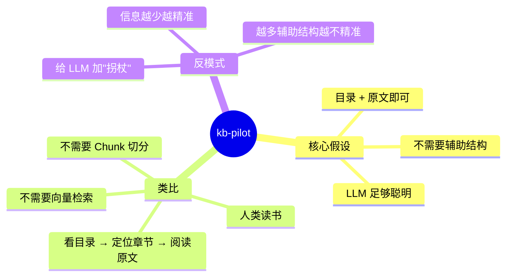
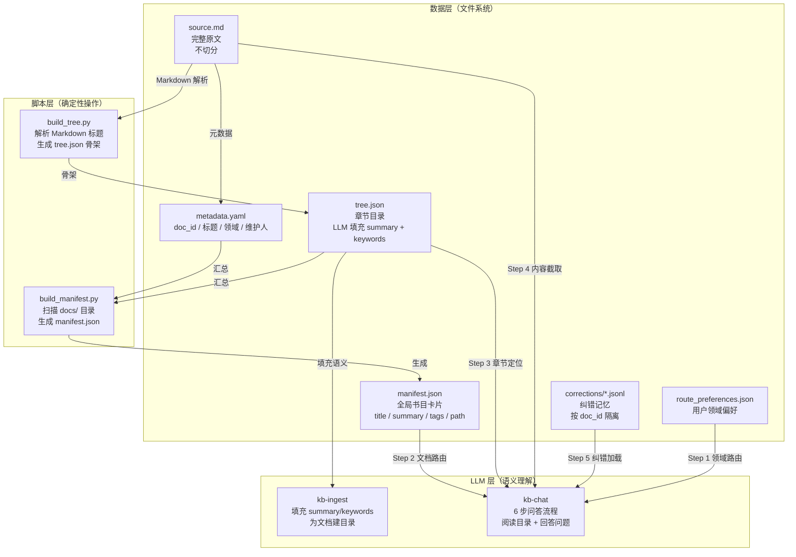
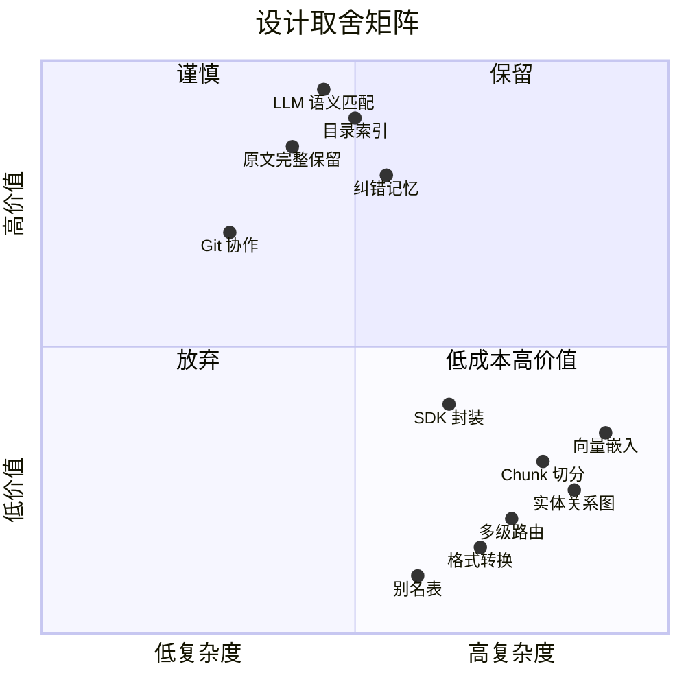

# 系统架构

## 设计哲学



**一句话**：把 LLM 当作会阅读的人，给它目录和原文，信任它自己理解。不切分、不向量化、不加辅助结构。

### 为什么"少即是多"

传统 RAG 默认 LLM 不够聪明，需要大量辅助结构来弥补。kb-pilot 反其道而行：

| 传统 RAG 的做法 | 为什么不需要 | LLM 能做什么 |
|---|---|---|
| Chunk 切分 | 破坏上下文连续性 | 直接从原文理解完整逻辑 |
| 向量嵌入 | 关键词匹配更精准 | 从 keywords 做语义匹配 |
| 实体关系图 | 过度设计 | LLM 原生理解实体间关系 |
| 别名/同义词表 | 维护成本高 | LLM 知道"贷记卡"="信用卡" |
| 多级路由层级 | 增加复杂度 | manifest.json 的 tags 足够 |
| 倒排索引 | 字符串匹配不如语义匹配 | LLM 语义匹配更智能 |

---

## 核心组件



### manifest.json —— 全局书目卡片

```json
{
  "doc_id": "doc_003",
  "title": "气候变化与碳中和",
  "domain": "科学",
  "summary": "全球变暖、碳排放、碳中和技术路径",
  "tags": ["碳中和", "碳排放", "CCS", "可再生能源", "碳交易"],
  "path": "docs/03_科学/doc_003_气候变化与碳中和/"
}
```

由 `build_manifest.py` 自动生成，汇聚所有文档的 title / summary / tags。LLM 通过语义匹配定位目标文档。

### tree.json —— 章节目录

```json
{
  "id": "ch_3_1",
  "level": 3,
  "title": "能源转型",
  "summary": "太阳能、风电、核能、氢能、CCS 五大减排技术",
  "keywords": ["太阳能", "风电", "核能", "氢能", "CCS", "减排"],
  "start_line": 49,
  "end_line": 58
}
```

`build_tree.py` 解析 Markdown 标题生成骨架，LLM 为每个节点填充 summary（≤20 字）和 keywords（3-8 个）。行号精确定位原文。

### memory/ —— 记忆系统

```
memory/
├── corrections/
│   ├── doc_001.jsonl    # Docker 纠错
│   ├── doc_003.jsonl    # 碳中和纠错
│   └── ...
└── route_preferences.json
```

纠错记录格式（JSONL）：

```jsonl
{"timestamp":"2026-08-01T10:00:00+08:00","question":"Docker 启动时间","correct_answer":"20.10 启动时间为 1.5s","doc_id":"doc_001","source_ref":"用户纠正","status":"active"}
{"timestamp":"2026-08-01T10:05:00+08:00","question":"Docker 启动时间","correct_answer":"20.10 启动时间为 1.2s","doc_id":"doc_001","source_ref":"其他专家纠正","status":"conflicted"}
```

| 状态 | 含义 | 处理 |
|------|------|------|
| `active` | 生效中 | 优先使用 |
| `conflicted` | 有争议 | 展示所有版本，用户选择 |

---

## 设计边界

### 我们做什么

| 职责 | 谁来做 |
|------|--------|
| 解析 Markdown 标题生成 tree.json 骨架 | `build_tree.py`（脚本） |
| 扫描 docs/ 生成 manifest.json | `build_manifest.py`（脚本） |
| 填充 summary / keywords | LLM（语义理解） |
| 领域路由、文档路由、章节定位 | LLM（语义匹配） |
| 纠错记录读写 | LLM（判断冲突） |

### 我们不做（设计选择，不是能力缺陷）



| 不做的事 | 原因 |
|----------|------|
| 文档格式转换（PDF/Word → MD） | 转换质量不可控，交给客户 |
| 向量嵌入 + 向量检索 | LLM 语义匹配比向量相似度更精准 |
| Chunk 切分 | 破坏上下文完整性 |
| 实体关系图 | LLM 不需要图结构理解实体 |
| 多级路由层级 | manifest.json 的 tags 足够 |
| 别名/同义词表 | LLM 原生理解同义词 |
| 倒排索引/TF-IDF | 语义匹配优于字符串匹配 |
| SDK/API 封装 | 纯文件系统，不引入服务化复杂度 |
| 多模态（图像/音频） | 聚焦文本，发挥 Git 原生优势 |

---

## 关键取舍

| 我们选择 | 我们放弃 | 原因 |
|----------|----------|------|
| 确定性路由 | 模糊检索的高召回 | 精准比全面更重要 |
| 完整原文 | 高效存储 | 上下文完整性优先 |
| LLM 全权理解 | 辅助结构 | 信任 LLM，不给拐杖 |
| 文件系统 + Git | 服务化/SDK | 简洁优先 |
| 纯文本 | 多模态 | 发挥 Git 原生文本协作 |
| 目录级索引 | 段落级索引 | 更接近人类阅读方式 |
| 客户自行转换 | 内置格式转换 | 不引入转换质量风险 |