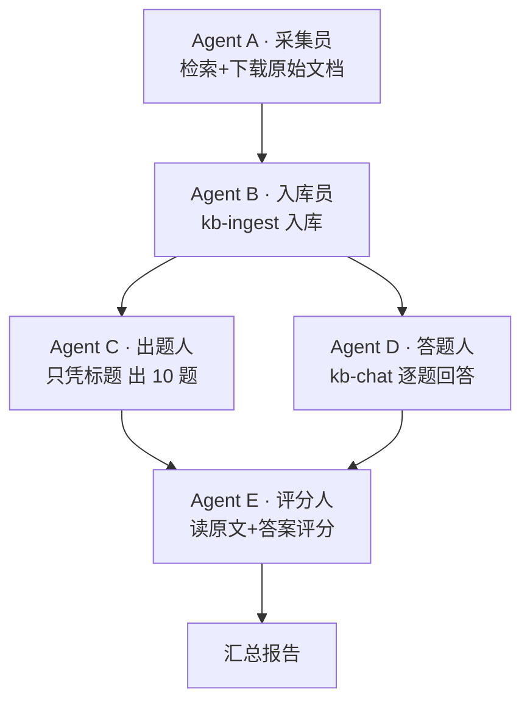

# kb-pilot 盲测规程

## 设计原则

**三权分立**：出题人、答题人、评分人相互独立，各自只知道完成任务所需的最小信息。

| 角色 | 任务 | 知道什么 | 不知道什么 |
|------|------|---------|---------|
| **Agent A · 采集员** | 从互联网获取原始文档 | 文档标题 | 问题、答案 |
| **Agent B · 入库员** | 执行 kb-ingest 完整流程 | 文档全文 | 问题、答案 |
| **Agent C · 出题人** | 基于标题出 10 道自然问题 | 文档标题 | 原文内容、答案 |
| **Agent D · 答题人** | 走 kb-chat 6 步流程回答 | manifest + tree + source | 标准答案 |
| **Agent E · 评分人** | 读原文与答题记录打分 | 原文 + 答题记录 | 出题过程 |

## 测试流程

## 文档选择标准

1. **标准答案可验证**：必须是网上能找到带答案的测试集，或国标/行标/规范类文档（答案在原文中）
2. **新鲜度**：优先选择 2025-2026 年发布的新文档，确保不在训练数据中
3. **中文优先**：与知识库主体语言一致
4. **篇幅适中**：50-200 行，有完整标题层级

## 出题要求

- 基于文档标题，不读原文
- 10 道题，覆盖 5 种题型：
  - 术语定义（2 题）
  - 多项列举（2 题）
  - 精确数值/条件（2 题）
  - 跨章节整合（2 题）
  - 对比分析/判断（2 题）
- 问题用自然语言，不提示在哪个章节找

## 答题要求

- 走 kb-chat 完整 6 步流程
- 记录每一步的中间结果（候选 doc_id、命中 ch_id、行号范围）
- 必须标注引用来源

## 评分标准

| 维度 | 满分 | 说明 |
|------|:----:|------|
| 文档路由 | 10 | 每道题 1 分，正确命中 doc_id |
| 章节定位 | 10 | 每道题 1 分，正确命中 ch_id |
| 答案正确性 | 20 | 每道题 2 分，内容准确、引用行号正确 |
| **综合** | **40** | |

## 评分细则

- 答案完全正确且引用行号在原文范围内 → 2 分
- 答案基本正确但引用行号有偏差 → 1 分
- 答案错误或凭训练数据编造 → 0 分
- 文档路由错误 → 该题章节定位和答案正确性自动 0 分

## 输出产物

| 文件 | 内容 |
|------|------|
| `blind-test-{date}-report.md` | 最终评分报告 + 逐题评分明细 |
| `blind-test-{date}-answers.md` | 答题记录（含中间步骤） |
| `blind-test-{date}-questions.md` | 出题记录 |