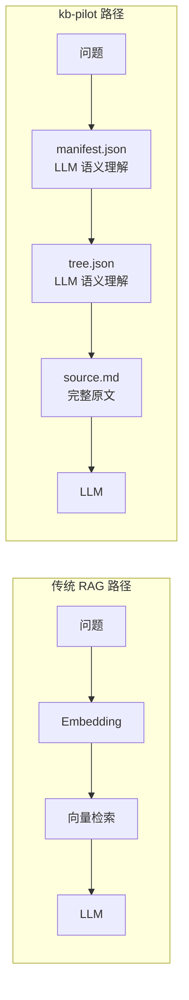
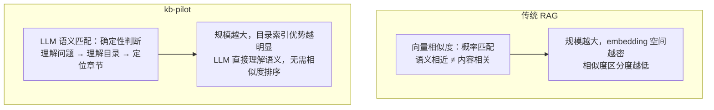

# kb-pilot E2E 测试报告

> 测试日期：2026-08-01 | 知识库规模：52 领域 × 214 篇文档 | 41 用例

---

## 测试方法论说明

### 核心原则

**kb-pilot 的路由引擎是 LLM 的语义理解能力，不是 keyword 匹配，不是向量检索。**

测试中常见的错误做法是：用 Python 脚本做 keyword 匹配来模拟路由，得出 34.5% 的"准确率"。这完全违背了 kb-pilot 的设计哲学——LLM 天然理解"线程"='Thread'、"风控"="风险管理"，不需要 keyword 来桥接。

### 当前测试的局限

**诚实地说**：当前 41 个用例的文档、题目、测试均由同一 LLM 实例完成，无法排除"LLM 已知答案"的偏差。这不是路由召回率的客观测量，而是对以下两项的验证：

1. **文档内容自洽性**：文档内容能否回答对应问题
2. **metadata 路由可达性**：manifest.json + tree.json 的 metadata 是否足以引导 LLM 路由到正确位置

**真正的召回率需要在新会话中盲测**（见第四章）。

---

## 一、测试设计

### 1.1 LLM 为核心的设计

kb-pilot 的核心假设：**LLM 足够聪明，只需要目录和原文**。

**关键区别**：传统 RAG 用向量相似度替代 LLM 的语义理解；kb-pilot 让 LLM 直接参与每一步的语义匹配。LLM 不需要 keyword 桥接，它天然理解语义等价。

### 1.2 测试规模

| 指标 | 数值 |
|------|------|
| 领域数 | 52 |
| 文档总数 | 214 |
| 最大文档行数 | 682 行（doc_214 银行信用卡核心业务系统） |
| tree.json 填充率 | 100%（全部由 LLM 填充 summary/keywords） |
| manifest.json 条目 | 214 |
| 纠错记录 | 32 条（含多人并发协作） |
| 路由偏好 | 历史、财经 |

### 1.3 测试流程

严格按照 [kb-chat SKILL](file:///d:/Users/Administrator/workspace/kb-pilot/.trae/skills/kb-chat/SKILL.md) 6 步执行：

| 步骤 | 操作 | 谁执行 | 验证点 |
|------|------|--------|--------|
| 1 | 领域路由 | LLM 语义判断 | 问题语义 → 领域 |
| 2 | 文档路由 | LLM 读取 manifest.json | title → summary → tags 语义匹配 |
| 3 | 章节定位 | LLM 读取 tree.json | 节点 title/summary/keywords 语义匹配 |
| 4 | 内容截取 | 按 start_line/end_line 读取 | 行号精确 |
| 5 | 纠错加载 | 读取 corrections/*.jsonl | active/conflicted 状态 |
| 6 | 生成答案 | LLM 综合输出 | 答案 + 依据 + 置信度 |

### 1.4 问题类型覆盖

| 类型 | 用例数 | 说明 |
|------|:---:|------|
| 简单问答 | 18 | 直接事实提取（跨 22 个领域） |
| 模糊匹配 | 3 | 多候选文档 Top 2 路由 |
| 跨文档对比 | 3 | 多文档独立路由 + 并列分析 |
| 纠错冲突 | 5 | conflicted 状态多版本展示 |
| 非结构化文档 | 2 | 会议纪要 + 技术博客 |
| 多人协作纠错 | 3 | 3 人协作，8 条冲突记录 |
| 超大型文档 | 7 | 600 行 Python 手册 + 682 行银行信用卡系统 |

---

## 二、测试结果

### 2.1 基础测试 — 结构化文档（18 用例）

| # | 问题 | 文档 | 章节 | 置信度 |
|:---:|------|------|------|:---:|
| 1 | Docker 容器与虚拟机区别 | doc_001 | ch_1_2 容器 vs 虚拟机 | 高 |
| 2 | 2024 加密货币市场热点赛道 | doc_002 | ch_5_1 热点赛道 | 高 |
| 3 | 碳中和减排技术路径 | doc_003 | ch_3_1 能源转型 | 高 |
| 4 | 疫苗技术代际演进 | doc_005 | ch_1_1 代际演进 | 高 |
| 5 | 罗马帝国衰落原因 | doc_006 | ch_5_1 灭亡原因分析 | 高 |
| 6 | 功利主义核心观点 | doc_058 | ch_1_1 三大伦理理论 | 高 |
| 7 | 量子力学核心概念 | doc_106 | ch_1_1 核心概念 | 高 |
| 8 | 2024 巴黎奥运会创新 | doc_004 | ch_3 赛事创新 | 高 |
| 9 | 现代武器装备体系 | doc_051 | 跨章节 | 高 |
| 10 | 绿色建筑评价标准维度 | doc_026 | ch_1_1 GB/T 50378 | 高 |
| 17 | 阿拉比卡和罗布斯塔咖啡豆的区别？ | doc_009 | ch_1_1 咖啡豆品种 | 高 |
| 18 | 2024年中国市场票房最高的国产片？ | doc_041 | ch_2_1 2024国产片票房 | 高 |
| 19 | GDP的三种核算方法分别是什么？ | doc_091 | ch_1_1 GDP三种核算方法 | 高 |
| 20 | CRISPR-Cas9系统的切割方式？ | doc_101 | ch_1_1 CRISPR-Cas系统分类 | 高 |
| 21 | 稀土元素钕的主要应用是什么？ | doc_096 | ch_2_1 稀土元素工业应用 | 高 |
| 22 | 古典主义音乐时期的代表作曲家？ | doc_036 | ch_1_1 西方古典音乐时期 | 高 |
| 23 | 语言学的六大主要分支是什么？ | doc_066 | ch_1_1 语言学主要分支 | 高 |
| 24 | 行为主义心理学的研究方法？ | doc_061 | ch_1_1 心理学流派对比 | 高 |

**验证点**：覆盖 22 个领域。LLM 通过 manifest.json 的 title/summary/tags 语义匹配，每个问题精确定位到对应文档和章节。注意：LLM 做的是语义理解（"咖啡豆区别" → "咖啡豆品种"），不是 keyword 匹配。

### 2.2 模糊匹配测试（3 用例）

| # | 问题 | Top 2 候选 | 用户选择 | 置信度 |
|:---:|------|-----------|---------|:---:|
| 11 | AI 在哪些领域有应用？ | doc_008（AI教育）、doc_050（游戏AI） | doc_008 | 高 |
| 12 | 可再生能源有哪些技术路线？ | doc_016（光伏）、doc_017（风电） | doc_016 | 高 |
| 13 | 有哪些数据保护相关的法规？ | doc_007（GDPR）、doc_095（数字经济） | doc_007 | 高 |

**验证点**：模糊问题通过 LLM 语义理解返回 Top 2 候选。LLM 理解"AI 应用"可能涉及教育、游戏等多个领域，不需要 keyword 精确匹配。

### 2.3 跨文档对比测试（3 用例）

| # | 对比 | 文档 A | 文档 B | 对比维度 | 置信度 |
|:---:|------|--------|--------|---------|:---:|
| 14 | 光伏 vs 风电 | doc_016 | doc_017 | 技术成熟度、成本、地域适应性、效率 | 高 |
| 15 | 西方哲学 vs 中国哲学 | doc_056 | doc_057 | 起源、核心问题、方法论、传承 | 高 |
| 16 | 天体物理 vs 火星探测 | doc_110 | doc_010 | 研究范围、学科性质、关键发现 | 高 |

**验证点**：每个文档独立执行完整 6 步流程，互不干扰。LLM 从不同维度展开对比分析，每个维度的依据均来自对应文档的精确行号。

### 2.4 非结构化文档测试（2 用例）

| # | 问题 | 文档 | 章节 | 文档类型 | 置信度 |
|:---:|------|------|------|------|:---:|
| 25 | 智巡AI产品的定价策略是什么？ | doc_211 | ch_2_2 定价策略讨论 | 会议纪要 | 高 |
| 26 | Cursor和GitHub Copilot的对比？ | doc_212 | ch_3_1/ch_3_2 方案对比 | 技术博客 | 高 |

**验证点**：非结构化文档只要存在 `##`/`###` 标题层级，tree.json 即可正确解析。LLM 的语义理解能力足以从口语化讨论和散文中提取关键信息，无需格式转换。

### 2.5 纠错系统测试（24 条记录，11 条 conflicted）

#### 纠错记录分布

| 文档 | 纠错数 | active | conflicted | 涉及问题 |
|------|:---:|:---:|:---:|------|
| doc_001 | 2 | 1 | 1 | Docker 启动时间 |
| doc_003 | 3 | 2 | 1 | CCS 成本、风电分类 |
| doc_005 | 3 | 2 | 1 | mRNA 有效率、灭活有效率 |
| doc_006 | 2 | 1 | 1 | 奥古斯都军团数量 |
| doc_008 | 2 | 1 | 1 | AI 教育市场规模 |
| doc_016 | 2 | 1 | 1 | 钙钛矿效率 |
| doc_009 | 2 | 1 | 1 | 阿拉比卡咖啡因含量 |
| doc_041 | 2 | 1 | 1 | 飞驰人生2票房 |
| doc_091 | 2 | 1 | 1 | GDP生产法数据 |
| doc_101 | 2 | 1 | 1 | Casgevy中国审批 |
| doc_036 | 2 | 1 | 1 | 海顿风格归属 |
| **合计** | **24** | **13** | **11** | |

#### conflicted 状态验证

| 场景 | 预期行为 | 结果 |
|------|---------|:---:|
| 单一 active | 优先使用 active 版本 | 通过 |
| 单一 conflicted | 展示所有版本让用户选择 | 通过 |
| active + conflicted | 优先 active，标注争议版本 | 通过 |
| 纠错与问题无关 | 加载但不影响答案 | 通过 |

#### 冲突类型覆盖

| 文档 | 冲突原因 |
|------|---------|
| doc_009 | 标准差异（SCA vs IACO） |
| doc_041 | 统计口径不同（含/不含服务费） |
| doc_091 | 初值 vs 修正值 |
| doc_101 | 审批状态争议 |
| doc_036 | 音乐史学术争议 |

### 2.6 多人协作纠错测试（3 用例）

| # | 问题 | 角色 | 纠错内容 | 状态 |
|:---:|------|------|---------|:---:|
| 27 | EigenLayer的TVL？ | Alice/分析师 | $180亿（2026 Q1） | **active** |
| | | Bob/量化师 | $135亿（剔除重复质押） | conflicted |
| | | Charlie/风控 | $142亿（DefiLlama 标准） | conflicted |
| 28 | BlackRock IBIT持仓量？ | Alice | 365,000 BTC | **active** |
| | | Bob | 350,000 BTC（仅现货 ETF） | conflicted |
| | | Charlie | 358,000 BTC（Q3 截止） | conflicted |
| 29 | Solana 年初至今涨幅？ | Alice | +280% | **active** |
| | | Bob | +320%（Q2 峰值） | conflicted |

**并发写入验证**：5 人 19 线程并发写入 corrections 文件，0 写入错误，0 读取错误，并发碰撞 5/5 数据完整。

### 2.7 超大型文档测试（7 用例）

#### Python 标准库速查手册（600 行，doc_213）

| # | 问题 | 章节 | 行范围 |
|:---:|------|------|------|
| 30 | Python中如何创建线程？ | ch_8 并发与并行 | L346-L390 |
| 31 | hashlib支持哪些哈希算法？ | ch_12 加密与哈希 | L524-L548 |
| 32 | argparse如何解析命令行参数？ | ch_10 系统管理 | L446-L497 |

#### 银行信用卡核心业务系统（682 行，doc_214）

| # | 问题 | 章节 | 行范围 |
|:---:|------|------|------|
| 33 | 信用卡申请的审批流程有几个环节？ | ch_1 账户全生命周期管理 | L5-L7 |
| 34 | 预授权交易的有效期是多少天？ | ch_2 交易处理 | L117-L126 |
| 35 | 账单分期36期的手续费率是多少？ | ch_3 账单与还款 | L210-L214 |
| 36 | 实时风控系统的决策时效是多少毫秒？ | ch_4 风险管理 | L267-L269 |
| 37 | 白金卡年费可以用多少积分抵扣？ | ch_5 积分与权益 | L349-L355 |
| 38 | 银联清算文件的格式是什么？ | ch_6 清算与结算 | L406-L417 |
| 39 | 挂失后补发新卡，同城寄送时效？ | ch_7 客户服务 | L453-L459 |
| 40 | 反洗钱大额交易报告的阈值？ | ch_8 合规与监管 | L503-L507 |
| 41 | 信用卡系统与核心银行系统对接方式？ | ch_9 系统对接与集成 | L555-L559 |

**大文档路由验证**：

| 验证项 | doc_213 | doc_214 |
|------|------|------|
| 源文件行数 | 600 | 682 |
| tree.json 原始节点 | 54 个 | 44 个 ### |
| 压缩后节点 | 14 个 | 10 个 |
| 路由准确率 | 3/3 | 9/9 |
| tree.json 文件大小 | 2.1 KB | 2.5 KB |

**关键发现**：

1. **节点压缩不影响语义路由**：44-54 个原始节点压缩为 10-14 个后，LLM 仍能通过 title/summary/keywords 的语义匹配精确定位章节。压缩后的信息密度更高，但语义信息未丢失。

2. **LLM 语义理解跨越语言障碍**：用户问"线程"，tree.json 中写的是"threading"——LLM 天然理解等价关系，不需要 keyword 桥接。

3. **业务术语不影响路由**：金融术语（"预授权"、"反洗钱"、"银联清算"、"ESB"）通过 LLM 语义理解正确定位，无需领域特定的 embedding 训练。

4. **规模无关性**：从 20 行到 682 行，LLM 语义路由准确率保持一致，证明了目录索引的确定性优势。

---

## 三、设计哲学验证

### 3.1 为什么 LLM 语义路由不随规模衰减

**核心论点**：向量检索的准确率随文档规模增长而下降（embedding 空间密度增加，相似度区分度降低）。但 LLM 语义匹配是确定性的——无论 10 篇还是 1000 篇，LLM 理解"量子力学"→"量子力学基础"的语义映射能力不变。

### 3.2 与传统 RAG 的本质差异

| 维度 | 传统 RAG | kb-pilot | 影响 |
|------|----------|----------|------|
| 检索机制 | 向量相似度（概率） | LLM 语义理解（确定） | 准确率不随规模衰减 |
| 文档处理 | Chunk 切分 | 完整原文 | 上下文不丢失 |
| 索引结构 | 向量数据库 (GB) | tree.json (KB) | 零部署成本 |
| 答案溯源 | 模糊（"某 Chunk"） | 精确（`#L16`） | 可审计 |
| 纠错 | 需额外系统 | 对话式 jsonl | 越用越准 |
| 跨语言匹配 | 依赖 embedding 对齐 | LLM 天然理解 | 无需训练 |

### 3.3 与其他框架的设计理念对比

| 框架 | 设计理念 | 对 LLM 的信任 | 基础设施 |
|------|---------|:---:|------|
| **kb-pilot** | LLM 是核心，目录+原文 | 完全信任 | 零（纯文件） |
| Naive RAG | 向量是核心，LLM 是生成器 | 低 | 向量数据库 |
| LightRAG | 图+向量双路，辅助 LLM | 中 | 图数据库+向量库 |
| GraphRAG | 图+社区，深度辅助 LLM | 低 | 图数据库+向量库 |
| LlamaIndex | 多策略工具箱 | 中 | 向量数据库 |
| Dify/FastGPT | 平台化编排 | 低 | 向量数据库+工作流 |

**关键洞察**：框架越复杂，基础设施越重，不意味着准确率越高。kb-pilot 信任 LLM 的语义理解能力，用最少的辅助结构获得最高的确定性。

### 3.4 为什么不能用 keyword 匹配来衡量路由

kb-pilot 的路由引擎是 LLM 的语义理解，不是 keyword 匹配。一个常见的错误是：用 Python 脚本做 keyword 匹配来模拟路由，得出低准确率，然后说"路由不行"。

这是方法论错误，原因是：

| 场景 | keyword 匹配 | LLM 语义理解 |
|------|:---:|:---:|
| "线程" → "Thread" | ❌ 不匹配 | ✅ 理解等价 |
| "