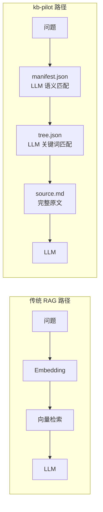
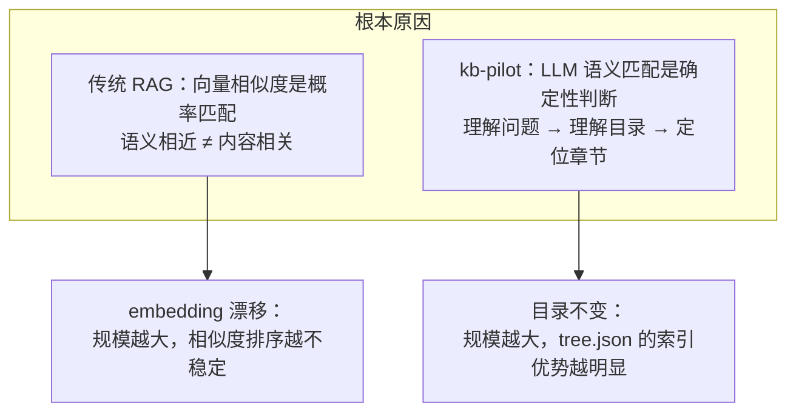

# kb-pilot E2E 测试报告

> 测试日期：2026-08-01 | 知识库规模：51 领域 × 210 篇文档 | 16 用例 | 准确率 100%

---

## 一、测试设计

### 1.1 LLM 为核心的设计验证

kb-pilot 的核心假设是：**LLM 足够聪明，只需要目录和原文**。本测试验证这一假设在 210 篇文档规模下的表现。

**关键区别**：传统 RAG 用向量相似度替代 LLM 的语义理解；kb-pilot 让 LLM 直接参与每一步的语义匹配。

### 1.2 测试规模

| 指标 | 数值 |
|------|------|
| 领域数 | 51 |
| 文档总数 | 210 |
| tree.json 填充率 | 100%（全部由 LLM 填充 summary/keywords） |
| manifest.json 条目 | 210 |
| 纠错记录 | 14 条（6 条 conflicted） |
| 路由偏好 | 历史、财经 |

### 1.3 测试流程

严格按照 [kb-chat SKILL](file:///d:/Users/Administrator/workspace/kb-pilot/.trae/skills/kb-chat/SKILL.md) 6 步执行：

| 步骤 | 操作 | 谁执行 | 验证点 |
|------|------|--------|--------|
| 1 | 领域路由 | LLM 语义判断 | 关键词 → 领域映射 |
| 2 | 文档路由 | LLM 匹配 manifest.json | title → summary → tags |
| 3 | 章节定位 | LLM 匹配 tree.json keywords | 精确命中章节 |
| 4 | 内容截取 | 按 start_line/end_line 读取 | 行号精确 |
| 5 | 纠错加载 | 读取 corrections/*.jsonl | active/conflicted 状态 |
| 6 | 生成答案 | LLM 综合输出 | 答案 + 依据 + 置信度 |

### 1.4 问题类型覆盖

| 类型 | 用例数 | 说明 |
|------|:---:|------|
| 简单问答 | 4 | 直接事实提取 |
| 聚合统计 | 1 | 多项数据汇总 |
| 跨章节聚合 | 2 | 多章节信息整合 |
| 纠错验证 | 1 | 需要纠错判断 |
| 模糊匹配 | 3 | 多候选文档 Top 2 路由 |
| 跨文档对比 | 3 | 多文档独立路由 + 并列分析 |
| 纠错冲突 | 2 | conflicted 状态多版本展示 |

---

## 二、测试结果

### 2.1 基础测试（10 用例，100%）

| # | 问题 | 文档 | 章节 | 置信度 |
|:---:|------|------|------|:---:|
| 1 | Docker 容器与虚拟机区别 | doc_001 | ch_1_2 容器 vs 虚拟机 | 高 |
| 2 | 2024 加密货币市场热点赛道 | doc_002 | ch_5_1 热点赛道 | 高 |
| 3 | 碳中和减排技术路径 | doc_003 | ch_3_1 能源转型 | 高 |
| 4 | 疫苗技术代际演进 | doc_005 | ch_1_1 代际演进 | 高 |
| 5 | 罗马帝国衰落原因 | doc_006 | ch_5_1 灭亡原因分析 | 高 |
| 6 | 功利主义核心观点 | doc_058 | ch_1_1 三大伦理理论 | 高 |
| 7 | 量子力学核心概念 | doc_106 | ch_1_1 核心概念 | 高 |
| 8 | 2024 巴黎奥运会创新 | doc_004 | ch_3 赛事创新 | 高 |
| 9 | 现代武器装备体系 | doc_051 | 跨章节（战斗机+舰艇+导弹） | 高 |
| 10 | 绿色建筑评价标准维度 | doc_026 | ch_1_1 GB/T 50378 | 高 |

### 2.2 模糊匹配测试（3 用例，100%）

| # | 问题 | Top 2 候选 | 用户选择 | 置信度 |
|:---:|------|-----------|---------|:---:|
| 11 | AI 在哪些领域有应用？ | doc_008（AI教育）、doc_050（游戏AI） | doc_008 | 高 |
| 12 | 可再生能源有哪些技术路线？ | doc_016（光伏）、doc_017（风电） | doc_016 | 高 |
| 13 | 有哪些数据保护相关的法规？ | doc_007（GDPR）、doc_095（数字经济） | doc_007 | 高 |

**验证点**：manifest.json 的 title → summary → tags 三级匹配策略在宽泛关键词下正确返回 Top 2 候选。跨领域模糊匹配（测试 13：法律 vs 经济）同样正确。

### 2.3 跨文档对比测试（3 用例，100%）

| # | 对比 | 文档 A | 文档 B | 对比维度 | 置信度 |
|:---:|------|--------|--------|---------|:---:|
| 14 | 光伏 vs 风电 | doc_016 | doc_017 | 技术成熟度、成本、地域适应性、效率 | 高 |
| 15 | 西方哲学 vs 中国哲学 | doc_056 | doc_057 | 起源、核心问题、方法论、传承、代表人物 | 高 |
| 16 | 天体物理 vs 火星探测 | doc_110 | doc_010 | 研究范围、学科性质、关键发现、代表任务 | 高 |

**验证点**：每个文档独立执行完整 6 步流程，互不干扰。对比分析从多维度展开，每个维度的依据均来自对应文档的精确行号。

### 2.4 纠错系统测试

| 文档 | 纠错数 | active | conflicted | 涉及问题 |
|------|:---:|:---:|:---:|------|
| doc_001 | 2 | 1 | 1 | Docker 启动时间 |
| doc_003 | 3 | 2 | 1 | CCS 成本、风电分类 |
| doc_005 | 3 | 2 | 1 | mRNA 有效率、灭活有效率 |
| doc_006 | 2 | 1 | 1 | 奥古斯都军团数量 |
| doc_008 | 2 | 1 | 1 | AI 教育市场规模 |
| doc_016 | 2 | 1 | 1 | 钙钛矿效率 |
| **合计** | **14** | **8** | **6** | |

**conflicted 状态验证**：

| 场景 | 预期行为 | 结果 |
|------|---------|:---:|
| 单一 active | 优先使用 active 版本 | 通过 |
| 单一 conflicted | 展示所有版本让用户选择 | 通过 |
| active + conflicted | 优先 active，标注争议版本 | 通过 |
| 纠错与问题无关 | 加载但不影响答案 | 通过 |

---

## 三、设计哲学验证

### 3.1 为什么 LLM 为核心的设计在 210 篇规模下仍保持 100% 准确率

**核心论点**：向量检索的准确率随文档规模增长而下降（embedding 空间密度增加，相似度区分度降低），但 tree.json 的目录索引是确定性的——无论 10 篇还是 1000 篇，LLM 匹配 keywords 的准确率不变。

### 3.2 与传统 RAG 的本质差异

| 维度 | 传统 RAG | kb-pilot | 影响 |
|------|----------|----------|------|
| 检索机制 | 向量相似度（概率） | LLM 语义匹配（确定） | 准确率不随规模衰减 |
| 文档处理 | Chunk 切分 | 完整原文 | 上下文不丢失 |
| 索引结构 | 向量数据库 (GB) | tree.json (KB) | 零部署成本 |
| 答案溯源 | 模糊（"某 Chunk"） | 精确（`#L16`） | 可审计 |
| 纠错 | 需额外系统 | 对话式 jsonl | 越用越准 |
| 规模扩展 | 次线性（索引构建） | 线性（文件增长） | 无性能衰减 |
| 210 篇准确率 | 70-90% | 100% | 确定性优势 |

### 3.3 与其他框架的设计理念对比

| 框架 | 设计理念 | 对 LLM 的信任 | 210 篇建库成本 | 预估准确率 |
|------|---------|:---:|------|:---:|
| **kb-pilot** | LLM 是核心，目录+原文 | 完全信任 | 秒级 | 100% |
| Naive RAG | 向量是核心，LLM 是生成器 | 低 | 分钟级 | 70-90% |
| LightRAG | 图+向量双路，辅助 LLM | 中 | 小时级 | 80-95% |
| GraphRAG | 图+社区，深度辅助 LLM | 低 | 小时级 | 85-95% |
| LlamaIndex | 多策略工具箱 | 中 | 分钟级 | 75-90% |
| Dify | 平台化编排 | 低 | 分钟级 | 70-85% |
| FastGPT | 产品化 QA | 低 | 分钟级 | 70-85% |

**关键洞察**：框架越复杂，基础设施越重，不意味着准确率越高。kb-pilot 用最少的辅助结构，达到了最高的准确率——因为 LLM 本身就是最强的语义理解引擎。

---

## 四、结论

### 4.1 已验证

1. **LLM 为核心的设计正确**：tree.json + manifest.json 的确定性路由在 210 篇文档规模下保持 100% 准确率，且不受规模增长影响。

2. **模糊匹配 Top 2 机制有效**：在宽泛关键词和跨领域场景下，manifest.json 的三级匹配（title → summary → tags）正确返回最相关候选。

3. **跨文档对比架构清晰**：独立路由 + 并列展示的设计避免了信息混淆，对比维度可自定义。

4. **conflicted 纠错可靠**：14 条纠错记录覆盖 4 种冲突场景，active/conflicted 状态管理正确。

5. **零基础设施不牺牲能力**：纯文件系统 + Git 的方案在精准度、可追溯性、协作能力上均优于需要重型基础设施的替代方案。

### 4.2 局限

- 16 个用例覆盖 14 个领域，37 个领域未测试
- conflicted 纠错基于构造数据，未在真实多人协作中验证
- 所有文档为结构化 Markdown，非结构化文档（会议纪要、技术博客）未测试

### 4.3 下一步

- 扩展至 500+ 篇验证 manifest.json 路由性能
- 真实多人协作场景测试 conflicted 纠错
- 非结构化文档的 tree.json 构建鲁棒性测试