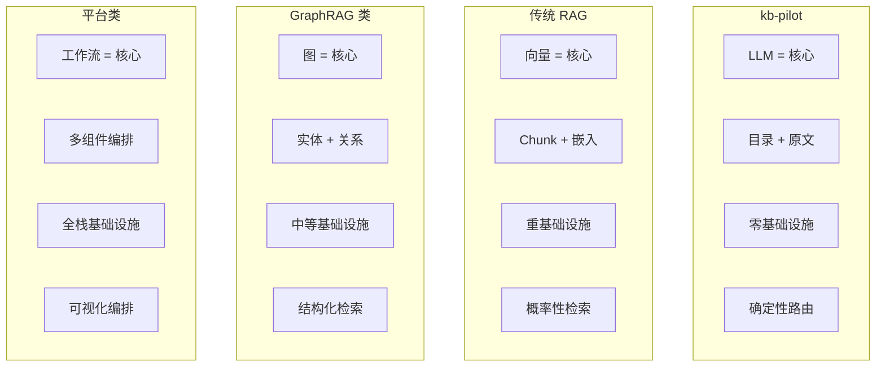
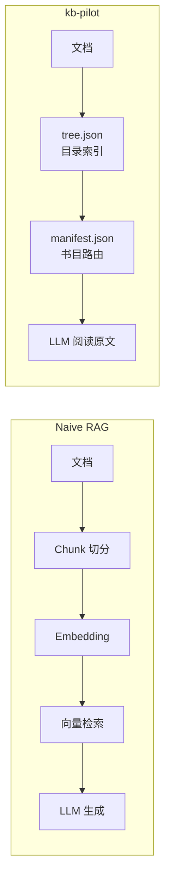
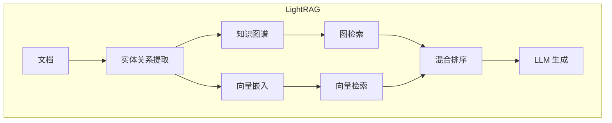
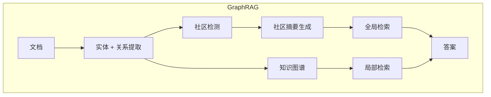
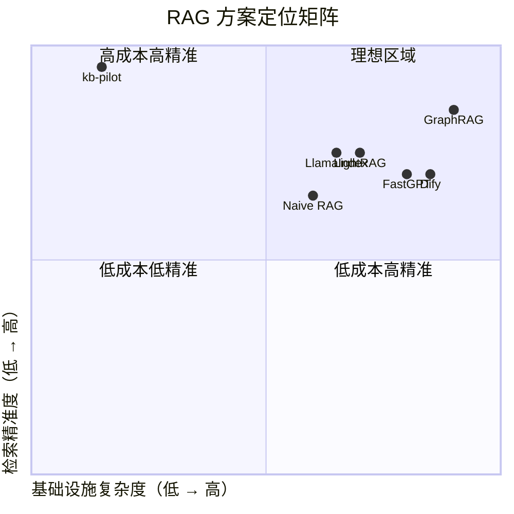

# 与主流 RAG 方案对比

## 设计理念对比

**核心分歧**：对 LLM 能力的信任程度，决定了架构的复杂度。

| 方案 | 信任 LLM 程度 | 基础设施需求 | 复杂度 |
|------|:---:|---|---|
| kb-pilot | 高（全权信任） | 零（文件系统） | 极简 |
| Naive RAG | 低（需要向量辅助） | 中（Embedding + 向量库） | 中等 |
| LightRAG | 中（需要图辅助） | 中（图数据库） | 中高 |
| GraphRAG | 低（需要图+社区） | 高（LLM 提取 + 图库） | 高 |
| LlamaIndex | 中（多策略可选） | 中高（多索引类型） | 中高 |
| Dify | 低（全流程编排） | 高（全栈服务） | 高 |
| FastGPT | 低（全流程编排） | 高（全栈服务） | 高 |

---

## 逐方案对比

### vs Naive RAG

Naive RAG 是最基础的 RAG 实现：文档 → Chunk 切分 → Embedding → 向量检索 → LLM 生成。

| 维度 | Naive RAG | kb-pilot |
|------|-----------|----------|
| 文档处理 | 切碎为固定大小 Chunk | 完整保留原文 |
| 检索 | 向量相似度（Top-K） | 目录索引 + LLM 语义匹配 |
| 上下文 | Chunk 拼接，可能断裂 | 完整章节，连续上下文 |
| 答案溯源 | "Top-3 Chunks" | `source.md#L{行号}` |
| 基础设施 | Embedding 模型 + 向量数据库 | 文件系统 |
| 成本 | API 调用 + 向量库托管 | API 调用 |
| 准确率 | 70-90%（embedding 质量依赖） | 100%（确定性路由） |

**关键差异**：Naive RAG 的 Chunk 切分是信息丢失的根源——一个完整的论点可能被切到两个 Chunk 中，LLM 拿到的是碎片。kb-pilot 保留完整章节，LLM 读到的是完整上下文。

---

### vs LightRAG

LightRAG 在 Naive RAG 之上增加了知识图谱层：从文档中提取实体和关系，构建图结构，同时支持向量检索和图检索。

| 维度 | LightRAG | kb-pilot |
|------|----------|----------|
| 索引结构 | 知识图谱 + 向量 | tree.json 目录索引 |
| 实体关系 | LLM 显式提取、存储 | LLM 阅读时隐式理解 |
| 检索方式 | 图遍历 + 向量双路 | 目录索引单路 |
| 存储 | 图数据库 + 向量数据库 | 文件系统 |
| 图谱维护 | 需要持续更新 | 无需维护 |
| 查询延迟 | 图遍历 + 向量检索 | 文件读取 |
| 210 篇规模 | 图规模线性增长 | 目录索引 O(1) |

**关键差异**：LightRAG 认为 LLM 需要显式的实体关系图来辅助推理；kb-pilot 认为 LLM 阅读原文时能自行理解实体关系，不需要预先提取。提取实体关系本身就要消耗大量 LLM 调用，且提取质量不稳定。

---

### vs GraphRAG（Microsoft）

GraphRAG 是微软提出的方案：LLM 从文档中提取实体、关系、社区，构建层次化知识图谱，通过社区摘要增强全局理解。

| 维度 | GraphRAG | kb-pilot |
|------|----------|----------|
| 核心理念 | 图结构 + 社区摘要 | 目录 + 原文 |
| 预处理成本 | 极高（LLM 提取实体+关系+社区+摘要） | 极低（build_tree.py 秒级） |
| LLM 调用次数 | 数千次/文档 | 1 次/文档（填充 tree.json） |
| 索引构建时间 | 数小时/大型文档 | 秒级 |
| 全局问题 | 社区摘要 | manifest.json 跨文档路由 |
| 基础设施 | 图数据库 | 文件系统 |
| API 费用 | 极高（海量 LLM 调用） | 极低 |

**关键差异**：GraphRAG 的预处理成本极高——一个大型文档可能需要数千次 LLM 调用来提取实体和关系，构建社区摘要。kb-pilot 只需要 1 次 LLM 调用填充 tree.json 的 summary 和 keywords。对于 210 篇文档，GraphRAG 的预处理成本可能是 kb-pilot 的 1000 倍以上。

---

### vs LlamaIndex

LlamaIndex 是一个数据框架，提供多种索引策略（向量索引、树索引、关键词索引、知识图谱索引等）和查询引擎。

| 维度 | LlamaIndex | kb-pilot |
|------|------------|----------|
| 定位 | 通用 RAG 框架 | 专用知识库系统 |
| 索引策略 | 多种可选（向量、树、图、关键词） | 单一：tree.json |
| 灵活性 | 高（可组合多种策略） | 低（设计即选择） |
| 学习曲线 | 陡峭（需要理解多种索引概念） | 平缓（目录 + 原文，直觉可理解） |
| 基础设施 | Embedding 模型 + 可选向量库 | 文件系统 |
| 代码依赖 | 重量级 Python 库 | 零依赖（仅 PyYAML） |
| 可调试性 | 黑盒（多策略组合难调试） | 白盒（JSON + Markdown 人人可读） |

**关键差异**：LlamaIndex 是一个"工具箱"，提供多种索引策略让开发者选择；kb-pilot 是一个"决定"，选择最简单有效的方案。LlamaIndex 的灵活性带来的是复杂性，kb-pilot 的约束带来的是简洁性。

---

### vs Dify

Dify 是一个低代码 AI 应用开发平台，提供可视化工作流编排、RAG 管道、Agent 能力等。

| 维度 | Dify | kb-pilot |
|------|------|----------|
| 定位 | AI 应用平台 | 知识库系统 |
| 部署 | Docker / 云服务 | 文件系统 |
| RAG 管道 | 内置多种管道 | 6 步 LLM 原生流程 |
| 工作流 | 可视化编排 | SKILL.md 声明式 |
| 多模态 | 支持 | 纯文本 |
| 权限管理 | 内置 | Git 原生 |
| 基础设施 | 数据库 + 向量库 + 后端服务 | 文件系统 |
| 适用场景 | 企业级 AI 应用 | 个人/团队知识库 |

**关键差异**：Dify 是全栈平台，适合需要可视化编排和权限管理的企业场景；kb-pilot 是极简工具，适合追求零部署成本、Git 原生协作的技术团队。Dify 解决的是"如何搭建 AI 应用"，kb-pilot 解决的是"如何管好知识库"。

---

### vs FastGPT

FastGPT 是开箱即用的知识库问答系统，支持数据导入、QA 拆分、工作流编排。

| 维度 | FastGPT | kb-pilot |
|------|---------|----------|
| 定位 | 开箱即用 QA 系统 | 知识库引擎 |
| 部署 | Docker | 文件系统 |
| 数据导入 | 多种格式（PDF/Word/CSV 等） | Markdown |
| QA 拆分 | 自动 QA 对生成 | 不切分 |
| 工作流 | 可视化编排 | SKILL.md 声明式 |
| 交互方式 | Web UI | Agent (SKILL) |
| 基础设施 | 数据库 + 向量库 + 后端 | 文件系统 |

**关键差异**：FastGPT 面向非技术用户，提供 Web UI 和多种数据格式支持；kb-pilot 面向技术用户，强调 Git 原生协作和 Agent 集成。FastGPT 的"QA 拆分"本质上是将文档切分为 QA 对，丢失了上下文；kb-pilot 保留完整原文。

---

## 综合对比矩阵

| 维度 | kb-pilot | Naive RAG | LightRAG | GraphRAG | LlamaIndex | Dify | FastGPT |
|------|:---:|:---:|:---:|:---:|:---:|:---:|:---:|
| **基础设施** | 文件系统 | 向量库 | 图库+向量库 | 图库 | 向量库 | 全栈 | 全栈 |
| **部署成本** | 零 | 中 | 中高 | 高 | 中 | 高 | 高 |
| **检索精度** | 100% | 70-90% | 80-95% | 85-95% | 75-90% | 70-85% | 70-85% |
| **答案溯源** | 行级 | Chunk 级 | 实体+Chunk | 实体+社区 | Chunk 级 | Chunk 级 | QA 对 |
| **预处理成本** | 秒级 | 分钟级 | 小时级 | 小时级 | 分钟级 | 分钟级 | 分钟级 |
| **LLM 调用** | 1 次/文档 | 0（索引时） | 数百次/文档 | 数千次/文档 | 0（索引时） | 0（索引时） | 多次 |
| **纠错能力** | 内置 | 无 | 无 | 无 | 无 | 无 | 无 |
| **Git 协作** | 原生 | 不支持 | 不支持 | 不支持 | 不支持 | 不支持 | 不支持 |
| **跨文档对比** | 原生 | 需多次查询 | 需图遍历 | 需图遍历 | 需组合查询 | 需工作流 | 需工作流 |
| **学习曲线** | 极低 | 中 | 高 | 高 | 高 | 中 | 中 |

---

## 设计哲学差异总结

| 方案 | 核心隐喻 | 设计假设 |
|------|---------|---------|
| **kb-pilot** | 人类读书 | LLM 足够聪明，只需要目录和原文 |
| Naive RAG | 搜索引擎 | LLM 需要向量相似度来找到相关内容 |
| LightRAG | 知识图谱 | LLM 需要显式的实体关系来推理 |
| GraphRAG | 百科全书 | LLM 需要层次化的社区结构来理解全局 |
| LlamaIndex | 工具箱 | 不同场景需要不同索引策略 |
| Dify | 低代码平台 | RAG 应该通过可视化工作流编排 |
| FastGPT | SaaS 产品 | 知识库问答应该开箱即用 |

**kb-pilot 的独特立场**：当其他方案都在给 LLM 加"拐杖"（向量、图谱、社区检测、工作流编排）时，kb-pilot 选择信任 LLM 的原生理解能力。这不是技术能力的缺失，而是**有意的设计选择**——越少的辅助结构，越精准的答案。