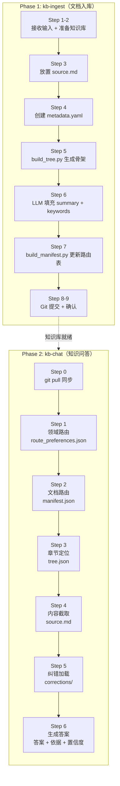
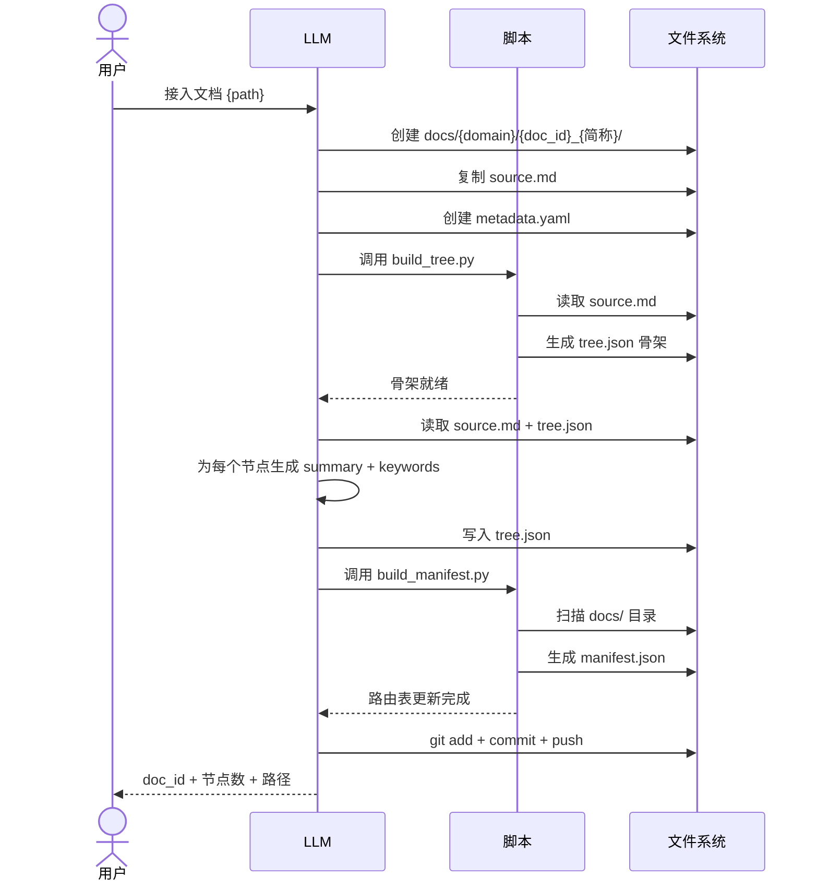
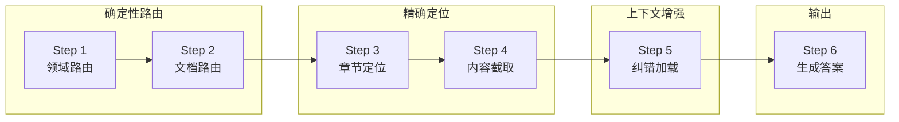
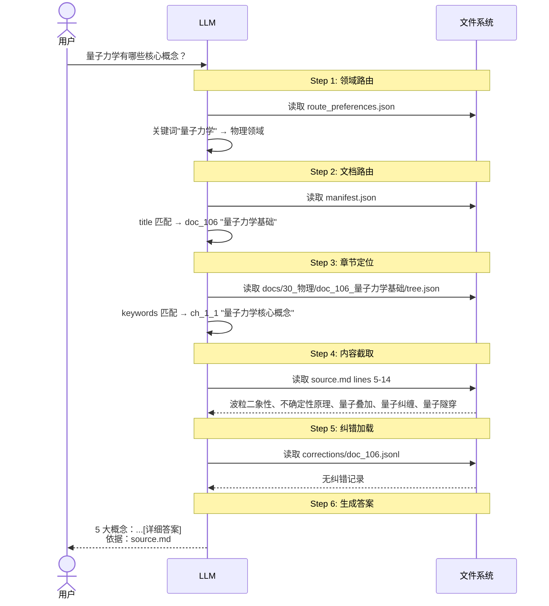
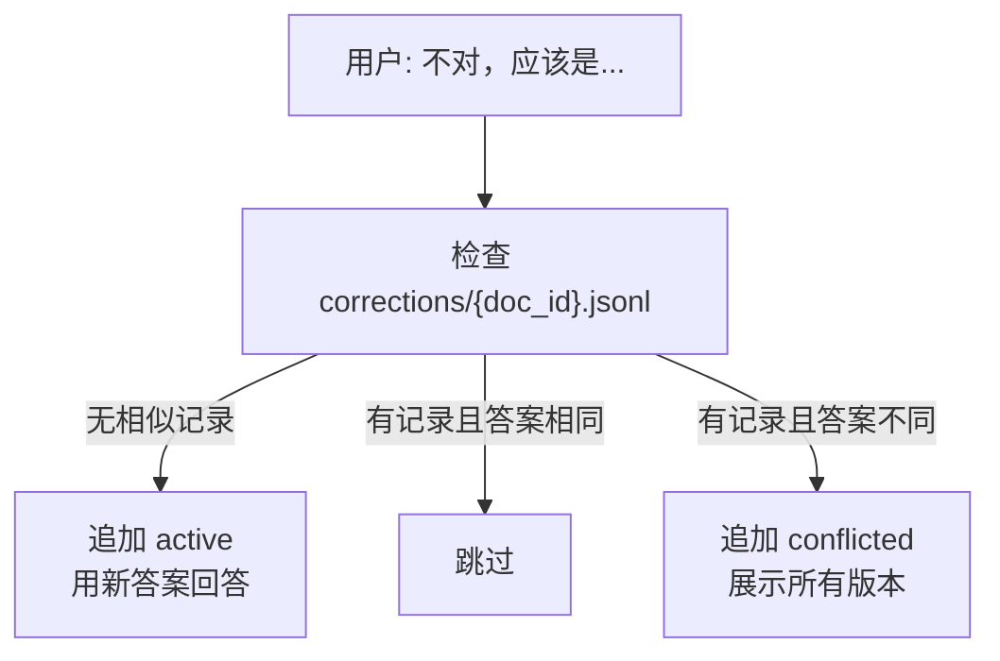
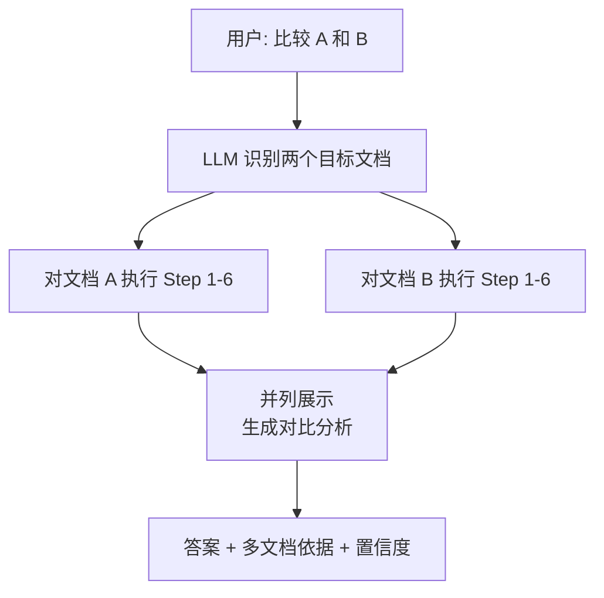
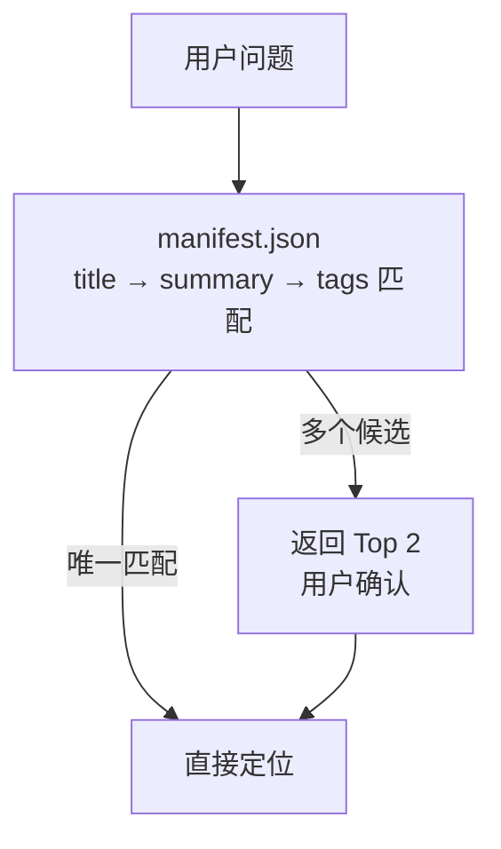
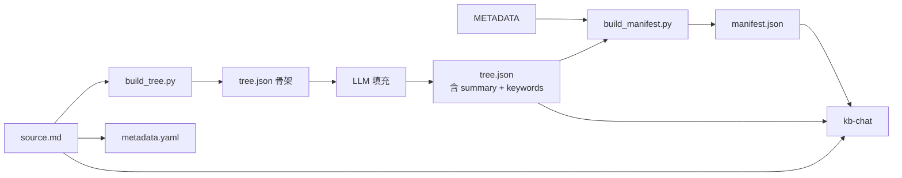

# 执行流程

## 全链路总览

---

## Phase 1: 文档入库（kb-ingest）

### 流程详解

### 脚本 vs LLM 分工

| 步骤 | 执行者 | 原因 |
|------|--------|------|
| Step 5: 生成 tree.json 骨架 | `build_tree.py` | 确定性操作，解析 Markdown 标题 |
| Step 6: 填充 summary/keywords | LLM | 语义理解，脚本无法替代 |
| Step 7: 生成 manifest.json | `build_manifest.py` | 确定性操作，扫描文件系统 |

---

## Phase 2: 知识问答（kb-chat）

### 6 步流程详解

### 具体示例：以"量子力学核心概念"为例

---

## 特殊流程

### 纠错流程

### 跨文档对比流程

### 模糊匹配流程

---

## 数据依赖关系

---

## 关键约束

- **脚本只做确定性操作**：`build_tree.py` 和 `build_manifest.py` 是仅有的两个脚本，其余全部由 LLM 执行
- **纠错按 doc_id 隔离**：不同文档的纠错互不影响
- **偏好仅存储显式表达**：不从对话历史推断用户偏好
- **每次回答必须引用行号**：`source.md#L{start}-L{end}`