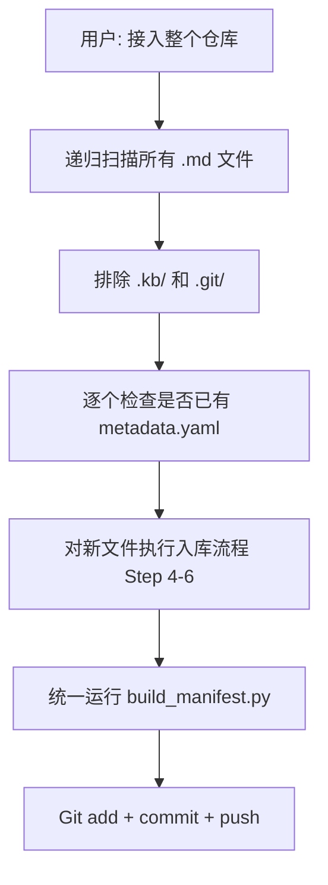

# kb-pilot 执行流程

## 1. 文档入库流程（kb-ingest）

```mermaid
flowchart TD
    A[接收 Markdown 文件路径] --> B{.kb/ 存在?}
    B -->|否| C[创建 .kb/ 目录结构]
    B -->|是| D[定位源文件]
    C --> D
    D --> E[检查标题层级 #/##/###]
    E --> F[分配 doc_id<br/>扫描 .kb/index/ 取最大序号+1]
    F --> G[计算镜像元数据目录<br/>.kb/index/{path 去掉 .md}/]
    G --> H[创建 metadata.yaml<br/>含 source_path]
    H --> I[运行 build_tree.py<br/>生成 tree.json 骨架到镜像目录]
    I --> J[LLM 填充 summary + keywords]
    J --> K[运行 build_manifest.py<br/>生成 .kb/manifest.json]
    K --> L[Git add .kb/ + commit + push]
    L --> M[告知用户 doc_id + 节点数]
```

### 关键路径计算

```
源文件: docs/api/auth.md
  ↓
元数据目录: .kb/index/docs/api/auth/
  ↓
metadata.yaml → source_path: docs/api/auth.md
tree.json → 输出到 .kb/index/docs/api/auth/tree.json
```

## 2. 问答流程（kb-chat）

```mermaid
flowchart TD
    Q[用户提问] --> S1[1. 读路由偏好<br/>.kb/memory/route_preferences.json]
    S1 --> S2[2. 文档路由<br/>读 .kb/manifest.json<br/>语义匹配 doc_id]
    S2 --> S2a{Top1 vs Top2<br/>差距明显?}
    S2a -->|是| S3[3. 章节定位<br/>读 .kb/index/.../tree.json<br/>语义匹配 ch_id]
    S2a -->|否| S2b[列出候选让用户选择]
    S2b --> S3
    S3 --> S4[4. 内容截取<br/>按 source_path 读源文件<br/>读取 start_line-end_line]
    S4 --> S5[5. 纠错加载<br/>读 .kb/memory/corrections/{doc_id}.jsonl<br/>LLM 判断相关性]
    S5 --> S6[6. 生成答案<br/>基于截取内容<br/>标注 doc_id + ch_id + source_path#L行号]
```

### 路径计算（问答时）

```
manifest 条目.path = "docs/api/auth.md"
  ↓
meta_dir = ".kb/index/" + path 去掉 ".md" = ".kb/index/docs/api/auth/"
  ↓
tree.json = {kb_path}/{meta_dir}/tree.json
source.md = {kb_path}/{path} = {kb_path}/docs/api/auth.md
```

## 3. 纠错流程

```mermaid
flowchart TD
    U[用户: 不对，应该是 X] --> C1[定位当前 doc_id + ch_id]
    C1 --> C2[追加到 .kb/memory/corrections/{doc_id}.jsonl]
    C2 --> C3{已有相同答案?}
    C3 -->|是| C4[重复记录 = 共识强化]
    C3 -->|否且有冲突| C5[标记 conflicted]
    C3 -->|否且无冲突| C6[标记 active]
    C4 --> C7[Git add + commit + push]
    C5 --> C7
    C6 --> C7
```

## 4. 批量接入流程



## 5. 文档重建流程

源文件大幅修改时：

1. 读取 `.kb/index/.../metadata.yaml` 获取 doc_id 和 title
2. 重新运行 build_tree.py（自动保留已有 summary/keywords）
3. 重新填充 summary 和 keywords（如果结构变了）
4. 运行 build_manifest.py 更新
5. Git commit + push
